# Adverse Events Following Immunization (AEFI) Tracker System Design

## Purpose

The Adverse Events Following Immunization (AEFI) Tracker System Design document provides an overview of the conceptual design used to configure a tracker program to support the notification, reporting and investigating of AEFI cases at national and sub-national levels. This document is intended for use by DHIS2 implementers and immunization program data managers to be able to support implementation and localization of the package. Local work flows and national guidelines should be considered in the localization and adaptation of this configuration package.

## Background

The Adverse Events Following Immunization (AEFI) digital data package was developed to support the [WHO’s Global Vaccine Safety Initiative (GVSI).](https://www.who.int/vaccine_safety/initiative/en/)  Effective and efficient management of AEFI’s is an essential component of all immunization programs in order to ensure continued public confidence in vaccination. The AEFI is modeled on the [WHO reporting and investigation form for AEFI](https://www.who.int/vaccine_safety/initiative/tools/AEFI_reporting_form_EN_Jan2016.pdf), and allows the user to capture case-based data using the WHO recommended [25 core variables](https://www.who.int/vaccine_safety/news/HL_1/en/), facilitate the investigation of adverse events, and generate reliable data for decision making. The AEFI tracker aims to support a sustainable approach to vaccine safety surveillance.

The AEFI may be adapted for monitoring safety of Covid-19 vaccines. Discussions are ongoing with content experts at WHO to understand the requirements and integration with this design.

## System Design Overview

### Use Case

The tracker data model used in DHIS2 enables tracking an individual AEFI case over time and linking with an unique identifier. This program enables health care providers, immunization program managers and the regulators at subnational and national level to report, access, modify, and analyze AEFI data.

The program is designed to support sub-national and national level workflows to accommodate reporting of adverse events from facilities, first-level investigation forms by district immunization officers, and national level investigations and outcomes. This [program](https://drive.google.com/file/d/19iP8_G0Q2uAkJAhBR5xOz0PMTvuve9q0/view?usp=sharing) also has the ability to function as a national repository to store, modify, and extract information for policy and regulatory decision making, and be the pivot around which local AEFI surveillance performance is assessed.  

The AEFI tracker package includes standard indicators and dashboard support, which are auto-populated to facilitate analysis. In addition, notifications can be generated to alert investigators and promote quick response.

This program is a standalone program that can be adopted on its own, or in combination with other Tracker programs, including the DHIS2 Immunization eRegistry tracker package.

### Intended Users

The AEFI tracker program is designed to support a general workflow for AEFI reporting and investigation. The first step to adopting the module is to identify the appropriate users and roles to match your country’s processes. The following roles should be discussed and mapped before adoption.

* Clinical & facility staff: Minimal data can be collected at point-of-care or by facility staff to notify and alert the next level for response and investigation.
* Facility Managers, District Immunization Officer/District Medical Officer: Review, and complete the data entry, and complete a sub district-specific analysis of the data. Working lists are designed to support staff to follow up cases through the stages of investigation.
* State/Province EPI officer, State/Province AEFI committee: Review and complete the data entry, also complete district-specific analysis, causality assessment and signal generation.
* National EPI manager, National AEFI committee, NRA/PV center: Review data and complete state/province or sub-state/province-specific analysis, assist causality assessment and signal generation.
* Data analysis users at multiple levels: Data can be disaggregated by hierarchical level and displayed on dashboards appropriate to facility, district and national levels. Health supervisors and program managers may also use the data to supervise and follow up on quality of care and documentation requirements.

While this package is developed to strengthen vaccine safety monitoring at national and sub-national levels, the 25 core variables included here will facilitate higher quality reporting into global databases such as Vigibase. Inclusion of variable mapping and the E2B standard applied by Vigibase will further reduce the burden of upwards reporting.

Example of possible entry points for intended users

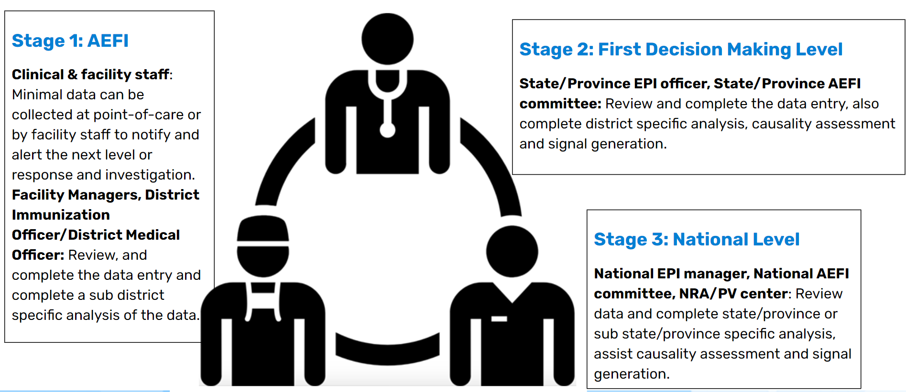

### Program Structure

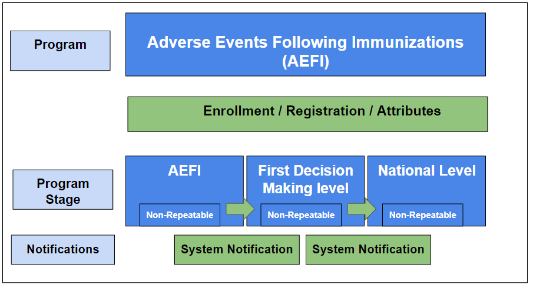

### Workflow following an AEFI case

The program is designed for the AEFI case to be enrolled at the facility organisation unit _where the AEFI case received the vaccination_, even if the data are being entered by investigators or reporters at another facility. This enables analysis of adverse events at the vaccination site.  The user entering data selects the vaccine site (e.g. facility) from the organization unit hierarchy and selects the AEFI program to register the case.

The reporting unit (the facility where the client presented with adverse event symptoms) is captured as a Data Element in the first program stage, with the form name ‘Reporting health facility address.’ For AEFI, data entry is often done at the district level, which means that the district users (or whoever is responsible for data entry for AEFI investigations) should have read/write access to all the vaccination sites (facilities, outreach posts, etc) in the district for the AEFI data entry program.

In contexts where facilities are able to directly report initial AEFI case data in DHIS2, there are likely scenarios where the adverse event notifies or presents at a facility other than the original vaccination site. In those cases, the reporting unit generally sends information to the vaccination site or to the responsible district officer to complete the reporting.

In rare cases where the vaccination site is located in another district, the district immunization officer responsible for the reporting unit, is generally expected to inform the district officer responsible for the vaccination site to report the data.

National data flows and reporting SOPs should be carefully considered when adopting this program to enable user assignment and access accordingly.

### User Groups

The following three core user groups are configured and included in the metadata package:

* AEFI data entry
  * These users may include users such as the AEFI investigator
  * Can view metadata
  * Can capture data for all program stages
* AEFI access
  * These users may include surveillance officers, district immunisation officers and national EPI officers and are group’ are generally responsible for analyzing the data.
  * Can view metadata
  * Can view data for all program stages
* AEFI admin
  * These users may include the core HMIS unit or IT support team who have access to edit the metadata to support the localization of the package.
  * Can edit metadata
  * No access to data.

In addition, three more user groups have been configured to enable notifications and different types of users to view or capture data according to their role in the AEFI investigation process by assigning access based on _program stage_. These are intended to provide an example of how a decentralized data view and capture might take place with users at different levels (e.g. district EPI officer responsible for initial investigation vs. national program responsible for reviewing the investigation data).

* AEFI District
  * Data capture for AEFI Stage
  * View data for First decision making level stage and National level stage
* AEFI first level decision making
  * View data at AEFI stage
  * Capture data at first decision making level stage
  * View data at National level stage
* AEFI national
  * View data on AEFI stage, and first decision making level stage
  * Capture data at national level stage

User access should be adapted to local context and assigned to the appropriate individuals based on job function. For example, district immunization officers may be included in the AEFI access user group but have access restricted only to their district. Read more about the configuration of users and user management in the [DHIS2 documentation.](https://docs.dhis2.org/master/en/dhis2_user_manual_en/manage-users-user-roles-and-user-groups.html)

### Rationale for Program Structure

The AEFI is modeled on the [WHO reporting and investigation form for AEFI](https://www.who.int/vaccine_safety/initiative/tools/AEFI_reporting_form_EN_Jan2016.pdf), and allows the user to capture case-based data using the WHO recommended [25 core variables](https://www.who.int/vaccine_safety/news/HL_1/en/), facilitate the investigation of adverse events, and generate reliable data for decision making.

### AEFI 25 Core Variables

| CORE VARIABLES | DESCRIPTION | Metadata Name and UID |
|---|---|---|
| **Identity** |||
| 1. Date AEFI reported first received at national centre | Date when the National level stage is created for the AEFI case I| AEFI - Date when seen for approval at national level   cWMUoQEuvtR |
| 2. Country where this AEFI reported | The name of the country where the data is first entered | ‘Country where this AEFI reported’   [Captured by the Parent of national Organisation Unit hierarchy] |
| 3. Location (address) | Geographic location of the case (address) | Address (current)   [TEI attribute]   VCtm2pySeEV |
| 4. Worldwide unique number | Unique number used for communicating the details of the case at the international level | AEFI - Final Classification   D42M2tdJo7R |
| **Patient Identifier** |||
| 5. Patient Identifier | The name of the patient or initials as decided by the country | Given name   [TEI attribute]   TfdH5KvFmMy |
| 6. Date of birth | Birthday | Date of Birth   [TEI attribute]   BiTsLcJQ95V |
| 7. Sex | Male or Female | Sex   [TEI attribute]   CklPZdOd6H1 |
| 8. Medical History | Free text | AEFI - Medical history   IV9W7YXh939|
| **Vaccine** |||
| 9. Primary suspect vaccine name (generic) | The vaccine that is suspected to have caused the AEFI | AEFI_Vaccine 1 name   uSVcZzSM3zg   AEFI_Vaccine 2 name   g9PjywVj2fs   AEFI_Vaccine 3 name   OU5klvkk3SM   AEFI_Vaccine 4 name   menOXwIFZh5 |
| 10. Other vaccines given just prior to AEFI | Other vaccines given just prior to AEFI | AEFI - Other vaccine 1 name   yr2dELskXm4   AEFI - Other vaccine 2 name   dKWFXaSNIef   AEFI - Other vaccine 3 name   NmQkARV9bm4   AEFI - Other vaccine 4 name   PDDaOMSiSDG |
| 11. Vaccine Batch number | Batch number of all vaccines mentioned above |AEFI - Batch/lot number (Vaccine 1)   LNqkAlvGplL   AEFI - Batch/lot number (Vaccine 2)   b1rSwGRcY5W   AEFI - Batch/lot number (Vaccine 3)   YBnFoNouH6f   AEFI - Batch/lot number (Vaccine 4)   BHAfwo6JPDa    [Data elements] |
| 12. Vaccine dose number for this particular vaccine | The dose number for the vaccine | AEFI - Vaccine 1 dose   LIyV4t7eCfZ   AEFI - Vaccine 2 dose   E3F414izniN   AEFI - Vaccine 3 dose   WlE0K4xCc14   AEFI - Vaccine 4 dose   Aya8C25DXHe |
| 13. Diluent Batch/lot number | The batch/lot number (if applicable) | AEFI - Diluent batch/lot number 1   FQM2ksIQix8   AEFI - Diluent batch/lot number 2   ufWU3WStZgG   AEFI - Diluent batch/lot number 3   MLP8fi1X7UX   AEFI - Diluent batch/lot number 4   MyWtDaOdlyD |
| **Event** |||
| 14. Date and time of vaccination | Date and time of vaccination | AEFI_Vaccination 1 date   dOkuCjpD978   AEFI - Vaccination 1 time   BSUncNBb20j   AEFI_Vaccination 2 date   VrzEutEnzSJ   AEFI - Vaccination 2 time   fZFQVZFqu0q   AEFI_Vaccination 3 date   f4WCAVwjHz0   AEFI - Vaccination 3 time   VQKdZ1KeD7u   AEFI_Vaccination 4 date   H3TKHMFIN6V   AEFI - Vaccination 4 time   S1PRFSk8Y9v |
| 15. Date and time of AEFI onset | Date and time of AEFI onset | AEFI - AEFI start date   vNGUuAZA2C2   AEFI - AEFI time   NyCB1VAOfJd |
| 16. Adverse events | The case diagnosis + signs and symptoms | AEFI - Adverse Events DE group   yhXZIbQuxOt   All DEs mapped in this DE group |
| 17. Outcome of AEFI | Recovered/resolved; recovering/resolving; not recovered/ not resolved; recovered/resolved with sequelae; fatal; unknown | AEFI - AEFI outcome   yRrSDiR5v1M |
|18. Serious |If the event resulted in death, threatened the patient’s life, caused disability, hospitalization, or congenital anomaly | AEFI - Severe event reported   fq1c1A3EOX5 |
| **Reporter** |||
| 19. Name of the first reporter of AEFI | Name of first reporter of AEFI | AEFI - Reporter of AEFI case   uZ9c4fKXuNS |
| 20. Institution/location | The address of the reporter | AEFI - Reporter's address   Q20pEixZxCs |
| 21. Position/department| Reporter’s designation | AEFI - Position/Department   Tgi4xP5DCzr |
| 22. Email ID | Reporter’s Email ID | AEFI - E-mail address   UmXSiK5Jlr4 |
| 23. Reporter’s phone number | Telephone | AEFI - Contact number   iLaon1495vY |
| 24. Date of report | Date when the report was submitted by the reporter in DHIS2 | ‘Report compilation date’   [captured by event Date for AEFI program stage] |
| **Other** |||
| 25. Comments (if any) | Free text | AEFI - Comments   LaMvzTltCOP |

### Tracker Program Configuration

| Structure | Description |
|---|---|
| Enrollment | Once a child is identified as having an AEFI they should be enrolled in the AEFI Program.  The enrollment stage will include personal information and unique identifiers, some of which will be auto generated.   Enrollment date = “Date patient notified the event to the health system” The date when the child is enrolled into the AEFI program. |
| Attributes | Attributes include information about the child and case identifiers   - AEFI Case ID   Unique System Identifier (EPI)   Given Name   Family Name   Sex   Date of Birth   Address   Mother/Caregiver's contact number |
| Stage 1: AEFI | This stage is a **non-repeatable** stage. Data is entered for this stage when an AEFI is reported. Includes detailed AEFI information and data elements needed for analysis.   This program stage has a custom form which matches the paper form which HCP’s are accustomed to using.   Event date = “Report compilation date”. This is the date when the  AEFI form is initiated. Also DOR (Date of Report) in AEFI surveillance analytics. |
| Stage 2: First Decision Making Level | This stage is a **non-repeatable** stage. Data is entered for this stage when the first decision making level has been completed.   This program stage has a custom form which matches the paper form HCP are accustomed to using.   Event date = “Report date” This is the date when the First Decision Making level form is initiated. |
| Stage 3: National Level | This stage is a **non-repeatable** stage. Data is entered for this stage when the National level investigation has been completed.   This program stage has a custom form which matches the paper form HCP are accustomed to using.   Event date = “Report date” This is the date when the National level form is initiated. |

### Enrollment Details

Enrolling a new patient is a relatively simple process. When you are entering personal information, DHIS2 will warn you if there are potential duplicate patients.  Once an organizational unit is selected, it will be linked to the patient.

The enrollment date description is “Date patient notified the event to the health system”. This is the date when the child is enrolled into the AEFI program. This date is also used as the DON (Date of Notification) in the AEFI surveillance analytics.

The enrolling organisation unit selected should reflect the facility organisation unit **_where the AEFI case (TEI) received the vaccination,_** even if the data is being entered by investigators or reports at another facility.

### Attributes

In countries where the DHIS Immunization eRegistry is being used, the person experiencing the adverse event is likely already registered as a TEI in Tracker. As the user enters attributes to register the enrollment, DHIS2 will conduct a search and alert the user of possible matches. The user should select the existing individual that matches, and continue data entry in order to not create a duplicate TEI. In this way, the AEFI will also be linked to the immunization record of the individual that can be seen in the Immunization Registry program.

There are limited fields that are mandatory to reduce the risk of false data being entered if a user is unable to enter all data fields. While the information on enrollment is meant to be completed when a case is first enrolled, attribute values can be updated at any point during an active enrollment if new information becomes available (eg contact information).

### Identifiers

Several identifiers have been applied to the configuration and can be adapted based on national context.

1. System generated unique ID: A TEI attribute **'Unique System Identifier (EPI)’** has been configured as an attribute that is unique within DHIS2. The identifier is auto-generated based on the pattern: CURRENT_DATE(yyyy-MM-dd) followed by a 5-digit sequential number (#####). This TEI attribute is intended to be programme-specific; that is, it is a unique ID within the system used only by the national EPI program: AEFI and Immunization eRegistry. This TEI attribute is shared across both the Immunization eRegistry and the AEFI programs to facilitate linkages between the two. **Because this ID is system generated, it is guaranteed that within an integrated DHIS2 instance, no two TEIs would be able to have the same EPI Unique System Identifier. **The pattern can be altered for country implementation based on other parameters.
2. Case ID:  This attribute **'AEFI Case ID'** is specific to the AEFI workflow. Typically, an adverse event is manually assigned a unique ID, generally at district or even national level. This TEI attribute is configured as free text to accommodate the ID assignment implemented in each country context, and can be updated to include validation according to expected format.

Additional identifiers can be added to the program according to national context. For example, if a National ID exists, it can be added as a TEI attribute to the AEFI and other tracker programs. This attribute is attached to the TEI itself and will remain constant across programs.

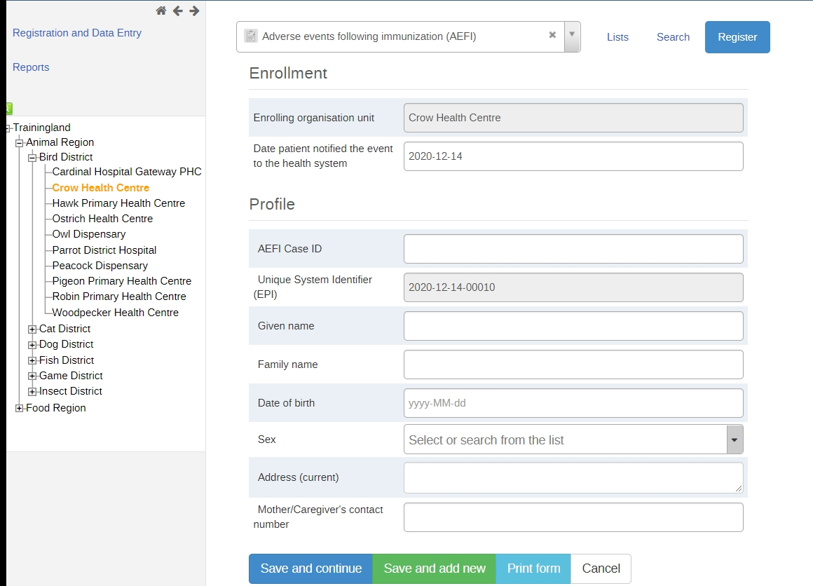

**Enrolling organisation unit:** is based on the organizational unit hierarchy (national, district, facility levels). The accessibility of seeing and charting in different “org units” is based on the user role of the user.

### Access

The **program** is configured as **protected** in order to protect personally identifiable data from unauthorized access. This means that a user may read and write to tracked entity instances that are owned by the organisation unit(s) to which the user is assigned data capture access, but their search scope should be wider than their read/write scope in order to ensure that they will identify any existing TEIs during a search, even if they do not belong to their org unit. If the search returns a TEI that exists outside of their organisation unit, the user is presented with the option to access the patient record by first recording a reason for accessing the record. This approach to privacy is known as ‘breaking the glass’, as it allows the user to make the decision to access the record without outside permission or assistance, but leaves a clear trail to be audited. Once the user gives a reason for breaking the glass, they gain temporary ownership of the tracked entity instance (see the [Tracker User Guide](https://docs.dhis2.org/2.34/en/dhis2_user_manual_en/using-the-tracker-capture-app.html#breaking-the-glass) for more information.)

The users that will complete stage 1 will likely be based at the district level, and have responsibility for investigating adverse events at all org units in their district. In order to correctly attribute data to the org unit where the immunization was given, this district level user should have read/write access to all org units that they are responsible for.

### Custom Form

This program has a custom html form that is aligned with the paper form HCP are accustomed to using. If you wish to add elements to the form, it will require some adaptation of the custom form. If you do not wish to use the form, it can be removed and the standard DHIS2 formatting can be used by following the instructions in the installation guide. **Note that program hide rules will not work with the custom form, although form logic can still be applied using javascript.**

### Program Stage 1: AEFI

This stage is a **non-repeatable** stage, as each adverse event for an individual is considered to be one enrollment leading to an investigation. Data is entered for this stage when an AEFI is reported, and it includes detailed AEFI information and the data needed for analysis.

The Event date for this program is identified as the “Report compilation date, which is assigned as the date when the AEFI form is initiated. This date is also used as the DOR (Date of Report) in the AEFI surveillance analytics. The stage may be completed by multiple users, according to the country work processes, with a lower level user providing initial information, and a user at a higher level providing greater detail.

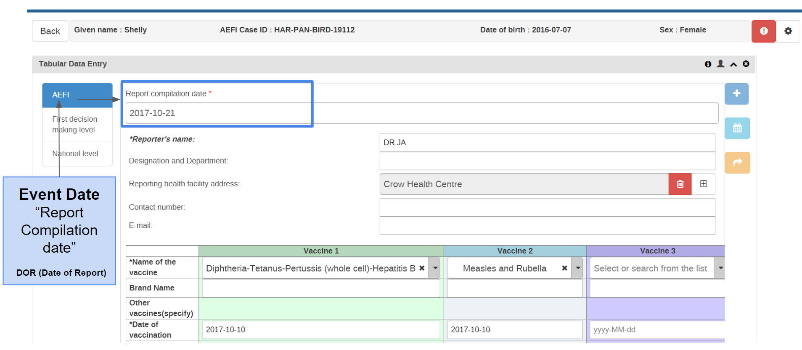

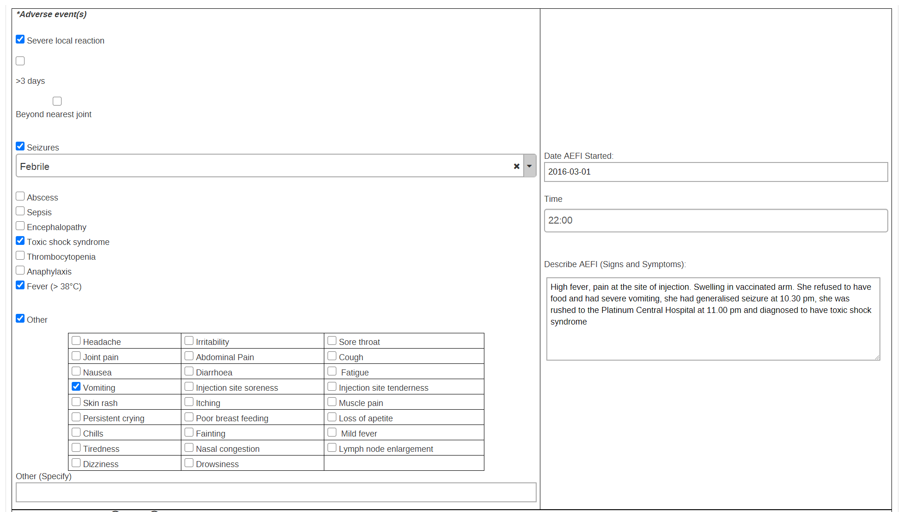

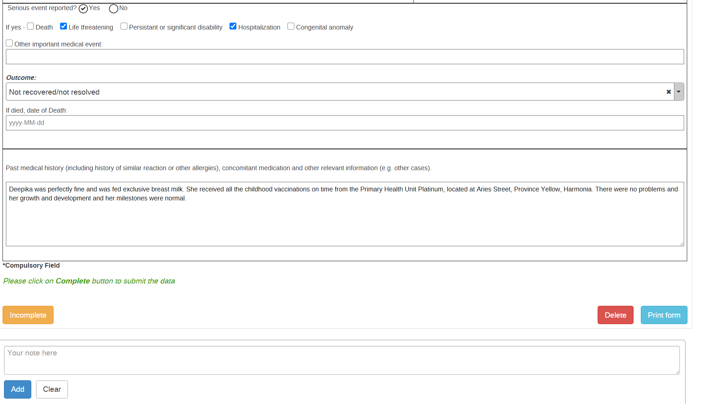

### Program Stage 2: First Decision Making Level

This stage is a **non-repeatable** stage. Data is entered for this stage when the first decision making level has been completed and a decision has been made about whether an AEFI investigation is needed.

The Event date for this program is named by default as the “Report date”, which is assumed to be the date when the data is entered into the system. The naming of the event date can be changed according to national protocols. This stage replicates the WHO investigation and reporting form, and supports analysis for investigation.  A data element for ‘’date in which investigation is planned’ is included in this stage to support analysis of the surveillance system indicators.

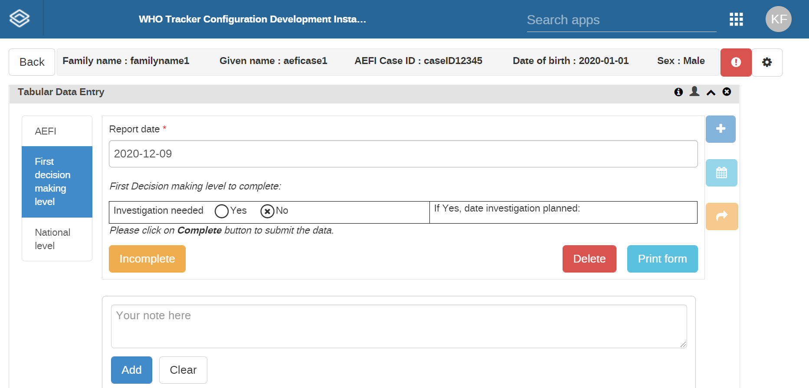

### Program Stage 3: National Level

This stage is a **non-repeatable** stage. Data is entered for this stage when the National level review has been completed and an AEFI worldwide ID can be assigned.

The Event date for this program is named by default as the “Report date”, which assumes the date at which the report is being entered into the system. This stage replicates the WHO investigation and reporting form.  In addition, a date is included as a Data Element for analyzing the date which the report was received at National level (which is important for surveillance indicators about time between reporting).

### Program Rules

For purposes of data validation and data quality, the following program rules have been configured according to WHO recommendations. If these conditions are met, the program is configured to trigger the action ‘_Show warning upon complete_’ to notify the data entry user of data quality errors:

* If investigation planned date is before date of vaccination
* If date of death is before date of onset (date AEFI started)
* If date of notification is before date of vaccination
* If date of onset is before date of vaccination
* If date of reporting at national level is before date of reporting
* If date of vaccination is before date of birth
* If date of vaccination is before date of reconstitution

A number of additional program rules have been configured to facilitate data entry. These can be reviewed in the metadata review file. **Note that when using the custom form, ‘hide field’ program rules configured for the ease of data entry will not function properly due to the workflow of the standard custom form.** With the custom form the program rules will show a warning once the complete button is pushed. However, these program rules are included in the configuration for countries that choose not to use the custom form.

**Hide** show rules have been added for vaccines with diluents. Not all vaccines are reconstituted with a diluent. A list has been configured of vaccines with diluents based on WHO recommendations and [WHO prequalified vaccines](https://extranet.who.int/pqweb/vaccines/prequalified-vaccines?field_vaccines_effective_date%5Bdate%5D=&field_vaccines_effective_date_1%5Bdate%5D=&field_vaccines_name=&search_api_views_fulltext=&field_pharmaceutical_form=Lyophilised%20active%20component%20%20to%20be%20reconstituted%20with%20excipient%20diluent%20before%20use&field_vaccines_number_of_doses=&page=6). When a vaccine that is reconstituted with a diluent is chosen the date elements associated with diluants will show based on program rules and enable the user to add the diluent information.

**Vaccines with Diluents:**
* Yellow Fever
* Haemophilus influenzae type b (Hib)
* BCG
* Dengue
* Japanese Encephalitis
* Measles
* Measles and Rubella
* Measles, Mumps, and Rubella
* Meningococcal A
* Influenza Pandemic (H1N1)
* Rotavirus
* Rabies
* Rubella
* Varicella
* Diphtheria-Tetanus-Pertussis (whole cell)-Hep B-Haemohilus influenzae type B (penta)

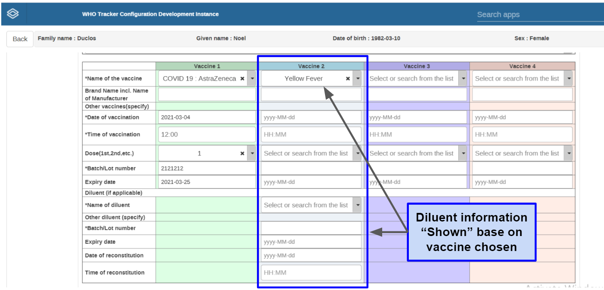

## Additional Features Configured to Support the Program

### COVID 19 Updates

COVID 19 requirements have been updated in the program

We have updated the age grouping disaggreations for analytics

* 0 - 1 year
* 1 - 5 years
* 5 - 18 years
* 18 - 60 years
* 60+ years

Pregnant and Lactating have been added with the following program rules.

* Mandatory fields to fill out sex and DOB
* If greater than >10 years and female show pregnant and lactating

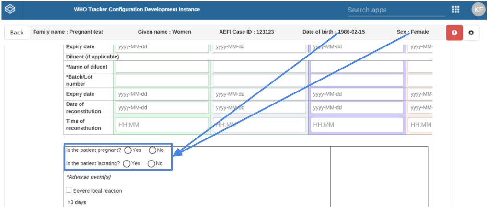

A list of known COVID19 vaccines have been added to the dropdown for “Name of Vaccine” this should be reviewed per country and updated as more vaccines are approved. There is also an option for “COVID19: other” which free text can be added.

“Brand Name incl. Name of Manufacturer” field was added as a free text box for the COVID context.

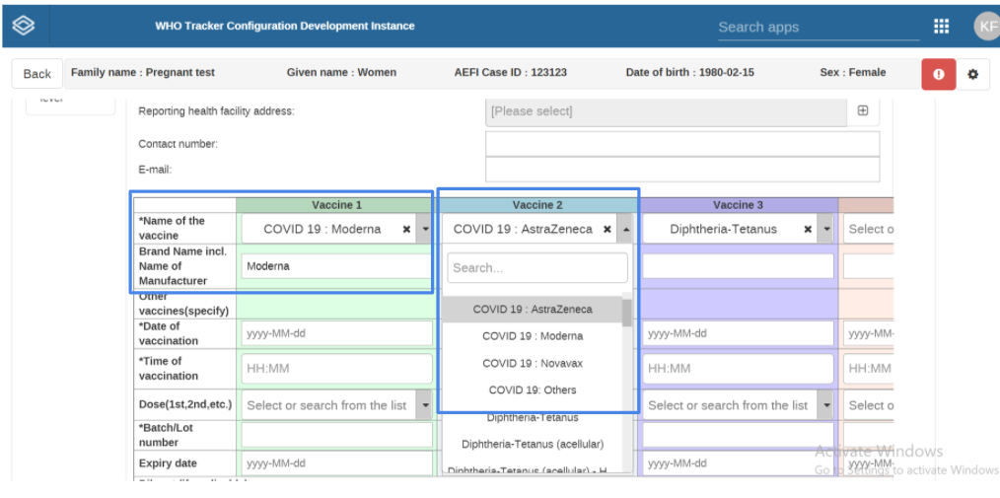

There have been three added adverse event options added for the specifically for COVID

* Bell’s Palsy
* Anaphylaxis
* Lymphadenopathy

Added text in the AEFI reporting form

“Past medical history (including history of similar reaction or other allergies), concomitant medication and dates of administration (exclude those used to treat reaction) other relevant information (e.g. other cases)”.

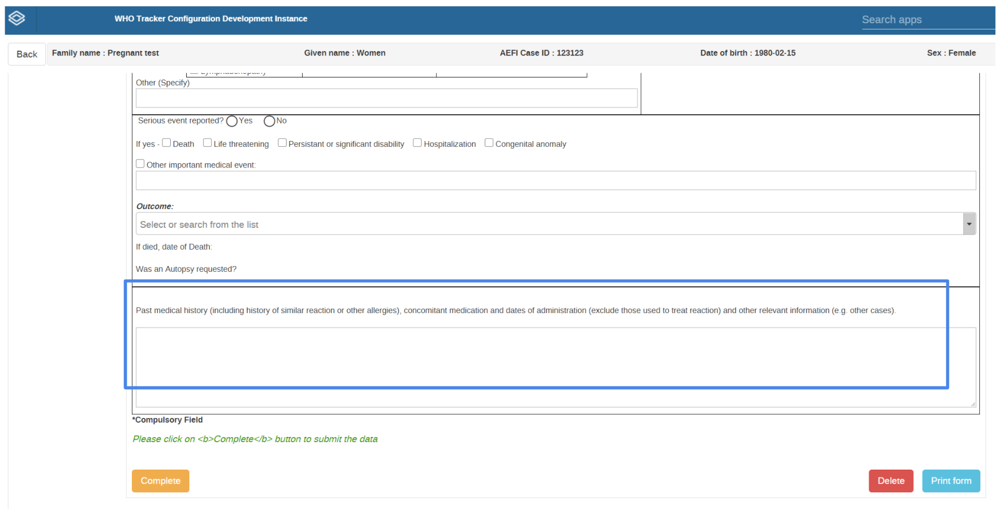

National level section updated with causality classifications.

For example:

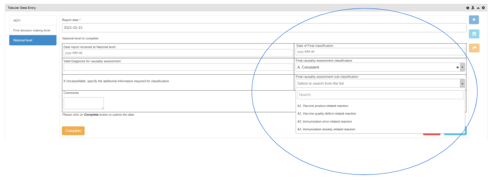

AEFI COVID Dashboard updates:

The AEFI COVID dashboard contains key monitoring indicators that are aligned with the WHO’s recommendations.

The first group of charts in the dashboard gives a quick overview of the AEFI’s by COVID vaccine type, geographical area, and events/reactions.

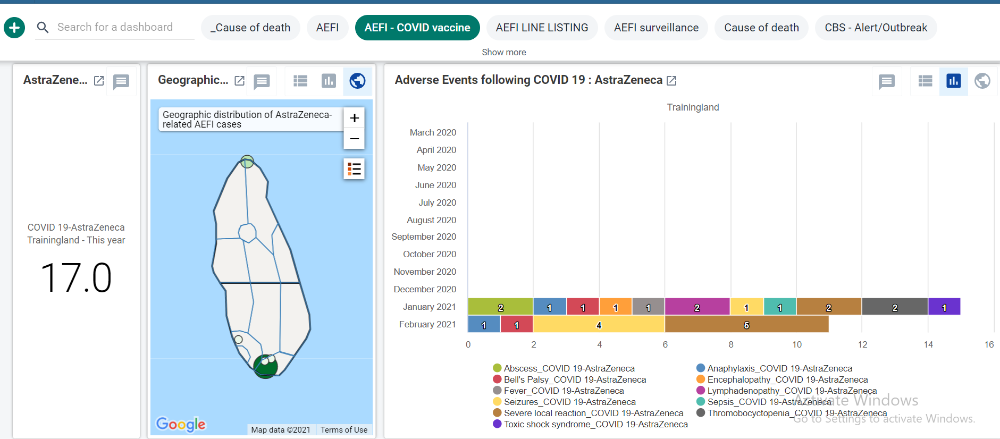

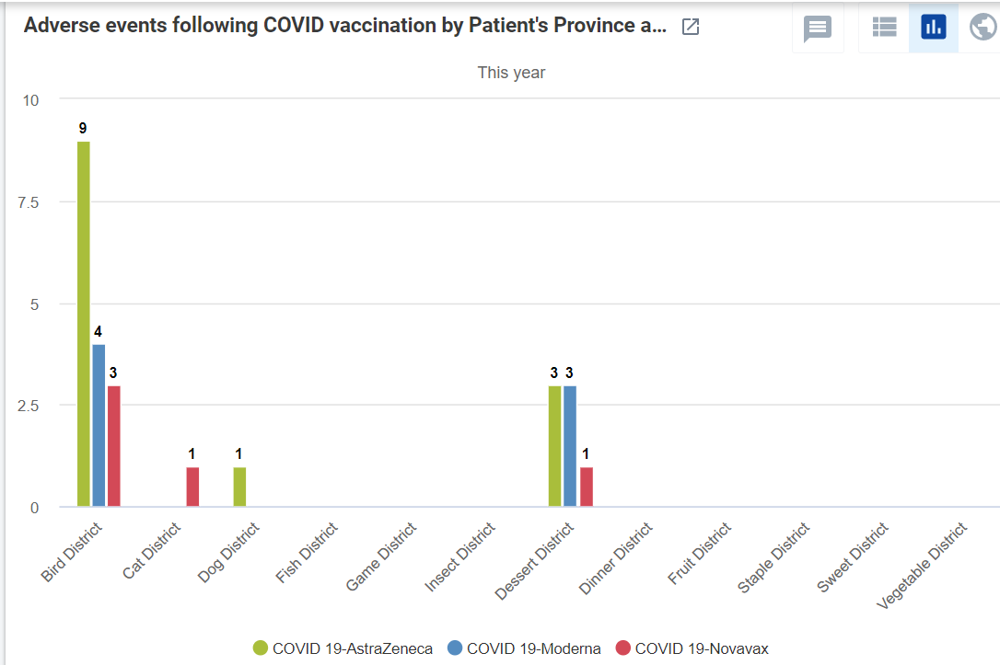

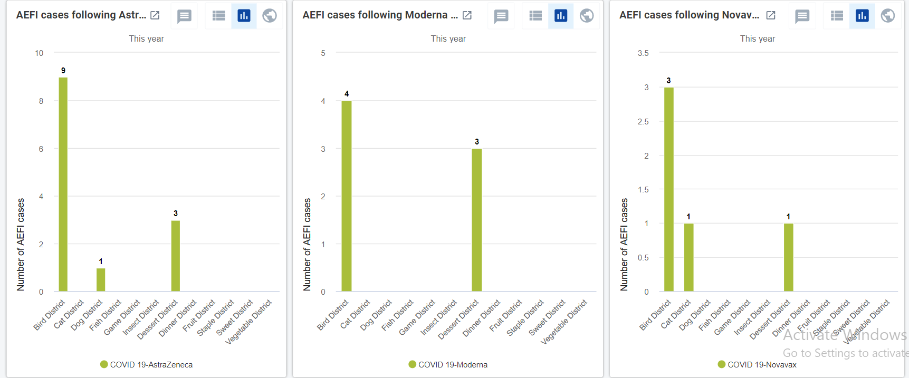

The second group of charts shows Adverse event following COVID vaccination type by pregnancy and lactation status

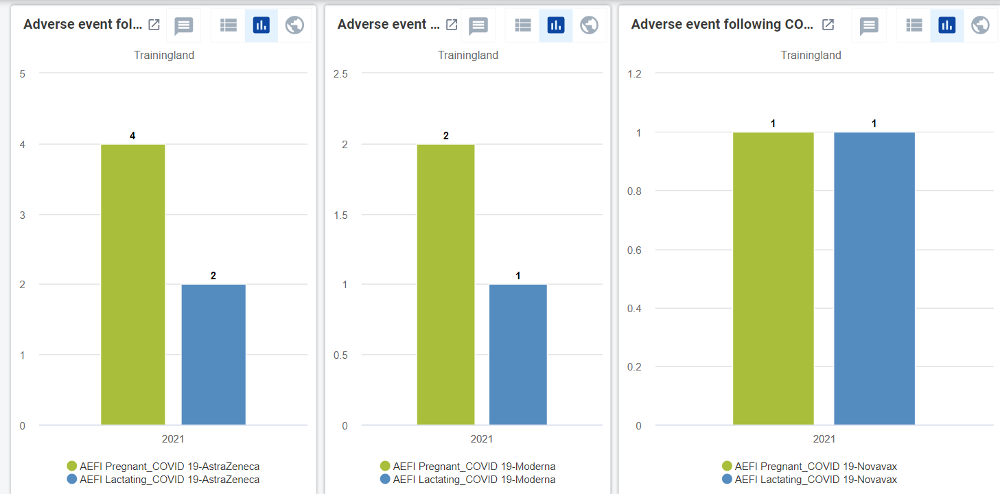

#### AEFI - Final causality assessment classification

This visualization is located on the AEFI dashboard.

* AEFI - Final classification

Pie chart: shows the total number of AEFI cases disaggregated by their Final causality assessment classification

#### AEFI - Final causality assessment sub-classification

This visualization is located on the AEFI dashboard.

AEFI - Final sub-classification
Pie chart: shows the total number of AEFI cases disaggregated by their final causality assessment sub-classification

### Notifications

Notifications have been configured to trigger a notification to defined user groups (eg. AEFI stage, First Level, and National Level) based on program stage completion. These notifications can be sent by system messages, external email (e.g. the email configured in the user’s account) or to SMS if an SMS gateway is configured. Notifications are optional according to country requirements and use and can be disabled.

The following notifications are pre-configured in the package:

1. **AEFI Event reported**: sent upon completion of AEFI program stage to _Users at Organisation Unit_ (e.g. facility) to alert that an adverse event was reported.
2. **AEFI Stage completed**: sent upon completion of AEFI program stage to _AEFI first level decision making_ user group to review the AEFI report and take the next action for investigation.
3. **AEFI first decision making level review completed:** notification sent based on program rule when first-level decision making is complete to the _AEFI National Level user group_ for national committee to review and approve the report according to national protocols.
4. **AEFI Investigation needed:** notification sent based on program rule if determined an investigation was needed based on DE in first level decision making stage; sent to users in _AEFI district group_ who are expected to start the first part of the investigation.
5. **AEFI National level review complete:** notification sent upon completion of national level stage to users in the user group _AEFI national_ to signify the national review has been completed and approved, and next steps can be taken such as for global reporting.

Here you can find information on how to configure program stage notifications. <https://docs.dhis2.org/2.33/en/dhis2_user_manual_en/configure-programs-in-the-maintenance-app.html#create-a-program-stage-notification>.
In order to set up SMS messaging you will need to set up an SMS gateway. Here you can find information on how to configure it <https://docs.dhis2.org/master/en/developer/html/webapi_sms.html>

### Line Listing

The line-listing included in the dashboard mirrors the 25 core variables identified by the Global Advisory Committee on Vaccine Safety (GACVS) in June 2012. These core variables cover the expected requirements for reporting upwards to regional and global vaccine safety databases. Efforts are underway to map and code these variables to the E2B guide used by Vigibase, the WHO global database of individual case safety reports.

* **note:** the screenshot above does not represent the full linelist; please refer to DHIS2 to review the linelist in full
* All the fields from the facility level line list are taken directly from the AEFI program. This includes fields from the registration process as well as the first stage within the program (labelled **“AEFI”**). The source of each of the fields within the line list is identified below.

| Field/column # | Variable name | Source | Description |
|-|---|---|---|
| 1 | Number |  | Number of the case in the list |
| 2 | DOR (date of report - report compilation date) | AEFI Stage | The event date of the AEFI program stage |
| 3 | DON (Date of Notification - date patient notified the event to the health system) | Registration Stage | Date patient notified the event to the health system. Enrollment date. |
| 4 | Incident date |  | N/A (ignore this field) |
| 5 | Organisation unit | Registration Stage | Organisation unit (which comes from the hierarchy) and most likely represents the facility in which the AEFI was registered |
| 6 | AEFI - Reporter of case | AEFI Stage | The person who reported the AEFI case |
| 7 | AEFI - Reporter’s address | AEFI Stage | The address of the person who reported the AEFI case |
| 8 | AEFI Case ID | Registration Stage | The unique locally assigned AEFI case ID |
| 9 | Given name | Registration Stage | The case’s given name |
| 10 | Family name | Registration Stage | The case’s family name |
| 11 | Date of birth | Registration Stage | The case’s date of birth |
| 12 | Sex | Registration Stage | The case’s biological sex |
| 13 | AEFI start date | AEFI Stage | The incident date of the AEFI (the date in which the AEFI started) |
| 14 | AEFI serious cases | AEFI Stage | Identifies if the case was serious or non-serious |
| 15 | AEFI - AEFI outcome | AEFI Stage | Identifies the outcome of the case as identified by health staff |
| 16 | AEFI - Vaccination 1 date | AEFI Stage | The date in which the **first** vaccine was administered to the case |
| 17 | AEFI - Vaccine 1 name | AEFI Stage | The name of the **first** vaccine that was administered to the case |
| 18 | AEFI - batch/lot number (Vaccine 1) | AEFI Stage | The batch/lot number of the **first** vaccine that was administered to the case |
| 19 | AEFI - Diluent batch/lot number 1 | AEFI Stage | The batch/lot number of the diluent used in the **first** vaccine that was administered to the case |
| 20 | AEFI - Vaccination 2 date | AEFI Stage | The date in which the **second** vaccine (if any) was administered to the case |
| 21 | AEFI - Vaccine 2 name | AEFI Stage | The name of the **second** vaccine (if any) that was administered to the case |
| 22 | AEFI - batch/lot number (Vaccine 2) | AEFI Stage | The batch/lot number of the **second** vaccine (if any) that was administered to the case |
| 23 | AEFI - Diluent batch/lot number 2 | AEFI Stage | The batch/lot number of the diluent used in the **second** vaccine (if any) that was administered to the case |
| 24 | AEFI - Vaccination 3 date | AEFI Stage | The date in which the **third** vaccine (if any) was administered to the case |
| 25 | AEFI - Vaccine 3 name | AEFI Stage | The name of the **third** vaccine (if any) that was administered to the case |
| 26 | AEFI - batch/lot number (Vaccine 3) | AEFI Stage | The batch/lot number of the **third** vaccine (if any) that was administered to the case |
| 27 | AEFI - Diluent batch/lot number 3 | AEFI Stage | The batch/lot number of the diluent used in the **third** vaccine (if any) that was administered to the case |
| 28 | Adverse events (individual data elements) | AEFI Stage | A list of all possible adverse events that are being reported on within the program. This includes all serious and non-serious events that are reported for a case and makes up the remaining columns of the line list |

#### Source Fields

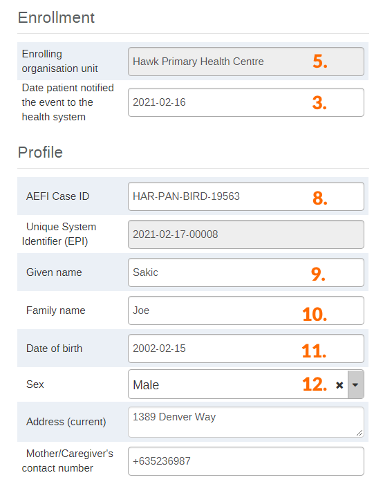

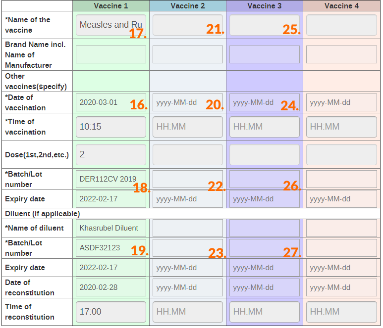

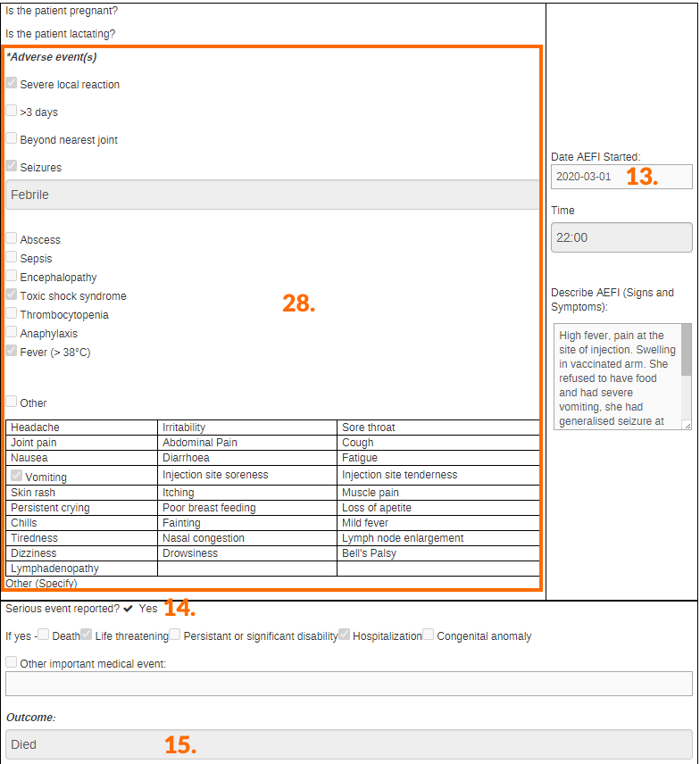

#### Visualizations

A number of the fields within the linelist are represented as visualizations within the dashboards available in the configuration package. These can all be modified to fit local needs if required. A brief description of the visualization(s) attached to each field within the line list are described below.

* Fields without visualizations:
Number, AEFI - Reporter of case, AEFI - Reporter’s address, AEFI Case ID, Given name, Family name, AEFI start date, AEFI - Vaccination 1 date, AEFI - Vaccination 2 date, AEFI - Vaccination 3 date, AEFI - batch/lot number (Vaccine 1), AEFI - batch/lot number (Vaccine 2), AEFI - batch/lot number (Vaccine 3), AEFI - Diluent batch/lot number 1, AEFI - Diluent batch/lot number 2, AEFI - Diluent batch/lot number 3

* DOR (date of report - report compilation date)
Please refer to the AEFI surveillance dashboard for more information on how this variable is used to generate outputs for the program

* DON (Date of Notification - date patient notified the event to the health system)
Please refer to the AEFI surveillance dashboard for more information on how this variable is used to generate outputs for the program

* DOO (Date of Onset - AEFI start date)
Please refer to the AEFI surveillance dashboard for more information on how this variable is used to generate outputs for the program

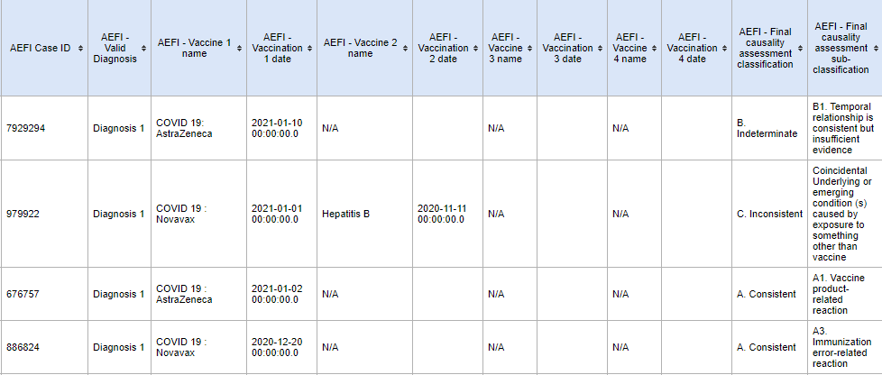

* **note:** the screenshot above does not represent the full linelist; please refer to DHIS2 to review the linelist in full

The National Level Line list has been added with the COVID updates.  This summary linelist is derived from data included in the AEFI reporting form in the National level section.  Which includes information related to the facility level data that is collected within the form.

* Located on the AEFI dashboard with the title “AEFI national summary (this year).”
* Consists of the following information (it is recommended that you have the linelist open within DHIS2 when reviewing this description)
* All the fields from the facility level line list are taken directly from the AEFI program. This linelist includes data from the registration process as well, the first stage within the program (labelled **“AEFI”**) as well as the third stage within the program (labeled “National level”). The source of each of the fields within the line list is identified below.

| Field/column # | Variable name | Source | Description |
|-|---|---|---|
| 1 | Number |  | Number of the case in the list |
| 2 | DON (Date of Notification - date patient notified the event to the health system) | Registration Stage | Date patient notified the event to the health system. Enrollment date. |
| 3 | Incident date |  | N/A (ignore this field) |
| 4 | Organisation unit | Registration Stage | Organisation unit (which comes from the hierarchy) and most likely represents the facility in which the AEFI was registered |
| 5 | AEFI Case ID | Registration Stage | The unique locally assigned AEFI case ID |
| 6 | AEFI - Date when seen for approval at national level | National level stage | The date in which the AEFI report was received at the national level in preparation for approval |
| 7 | AEFI - Date of final classification | National level stage | The date in which the final classification of the AEFI was made |
| 8 | AEFI - Valid Diagnosis | National level stage | The validated diagnosis used for the causality assessment |
| 9 | AEFI - Vaccine 1 name |  AEFI Stage| The name of the first vaccine that was administered to the case |
| 10 | AEFI - Vaccination 1 date | AEFI Stage | The date in which the first vaccine was administered to the case |
| 11 | AEFI - Vaccine 2 name | AEFI Stage | The name of the second vaccine (if any) that was administered to the case |
| 12 | AEFI - Vaccination 2 date | AEFI Stage | The date in which the second vaccine (if any) was administered to the case |
| 13 | AEFI - Vaccine 3 name | AEFI Stage | The name of the third vaccine (if any) that was administered to the case |
| 14 | AEFI - Vaccination 3 date | AEFI Stage | The date in which the third vaccine (if any) was administered to the case |
| 15 | AEFI - Vaccine 4 name | AEFI Stage | The name of the third vaccine (if any) that was administered to the case |
| 16 | AEFI - Vaccination 4 date | AEFI Stage | The date in which the third vaccine (if any) was administered to the case |
| 17 | AEFI - Final causality assessment classification | National level stage | The final causality assessment of the AEFI as determined by the national level review team |
| 18 | AEFI - Final causality assessment sub-classification | National level stage | The final causality assessment sub-classification of the AEFI as determined by the national level review team |

The linelist highlights the link between the vaccination which caused an AEFI and the final causality assessment classification and sub-classification as determined by the national level review team.

#### Source Fields

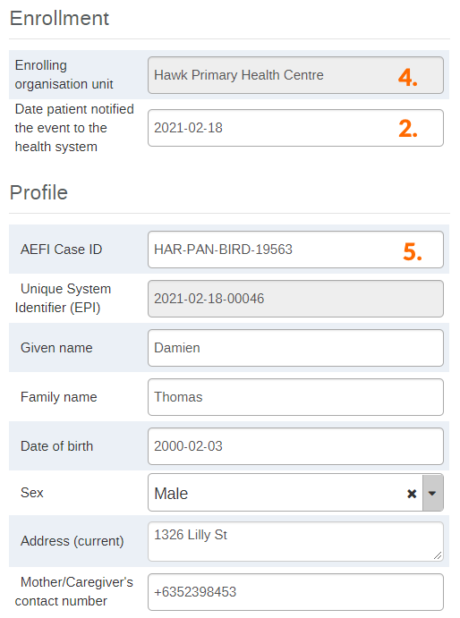

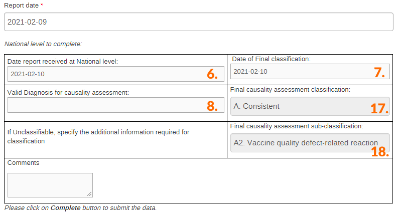

#### Visualizations

Visualizations associated with the AEFI stage are detailed in the overview of the AEFI facility level line list. There are two key visualizations associated with causality assessment classification and sub-classification.

##### AEFI - Final causality assessment classification

This visualization is located on the AEFI dashboard. Pie chart shows the total number of AEFI cases disaggregated by their Final causality assessment classification

##### AEFI - Final causality assessment sub-classification

This visualization is located on the AEFI dashboard. Pie chart shows the total number of AEFI cases disaggregated by their final causality assessment sub-classification

## Android Compatibility for Data Collection

Digital data packages are optimized for Android data collection with the DHIS2 Capture App, free to download on the [Google Play store](https://play.google.com/store/apps/details?id=com.dhis2&hl=en). The following are known limitations of DHIS2 Android Capture app v 2.2.0 with implications on this tracker package:

* The custom data entry form is not supported

## Dashboards, Analytics and Indicators

The package includes pre-configured program indicators aligned with WHO recommended requirements. The dashboard included in the package is designed for national level analysis, but can also be viewed by sub-national staff for their own district or province.

The dashboard follows WHO recommendations for generating analytical outputs for descriptive epidemiological analysis and for key vaccine safety surveillance indicators (e.g. such as time-between reporting and investigation between levels of the system).

## References

WHO. (2018). Global vaccine safety: the global vaccine safety initiative (GVSI). Retrieved from: <https://www.who.int/vaccine_safety/initiative/en/>

WHO. (2018). Global Vaccine Safety: Adverse events following immunization (AEFI). Retrieved from: <https://www.who.int/vaccine_safety/committee/topics/global_AEFI_monitoring/en/>
