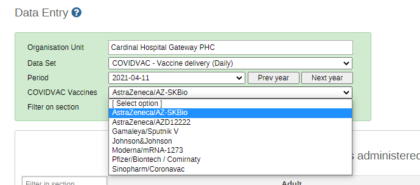
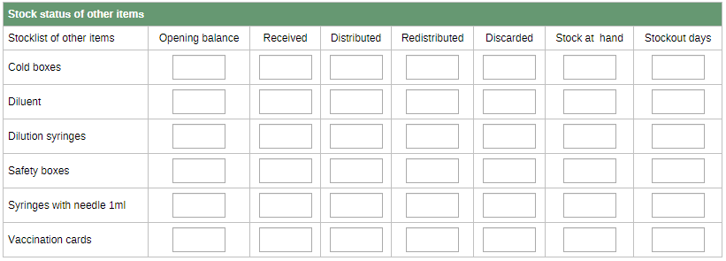
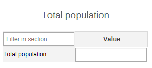
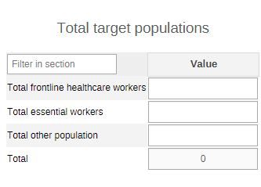
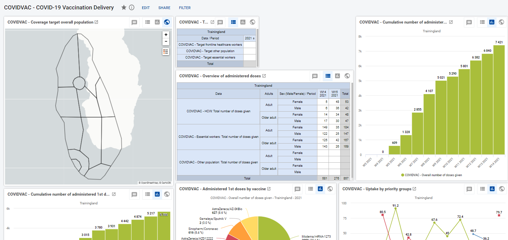
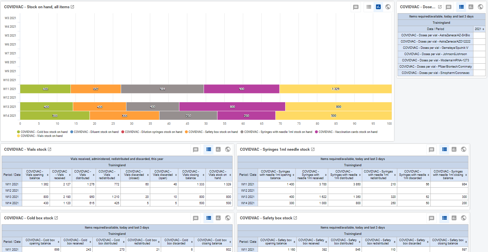

# COVID-19 Vaccine Delivery (COVIDVAC) Aggregate System Design Guide - Version 1.1.0

## 1. Introduction

The version 1.1.0 of the aggregate COVID-19 Vaccine Delivery (COVIDVAC) metadata package has been developed as an installable solution for countries to update their DHIS2-based HMIS and immunization data systems according to the updated version of the[WHO Guidance on developing a national deployment and vaccination plan for COVID-19](https://www.who.int/publications/i/item/monitoring-covid-19-vaccination-interim-guidance).

The COVIDVAC Aggregate System Design document provides an overview of the design principles and global technical guidance used to develop a WHO standard metadata package for monitoring COVID-19 vaccination delivery. This document is intended for use by DHIS2 implementers at country and regional level to be able to support implementation and localisation of the package. The COVIDVAC metadata package can be adapted to local needs and national guidelines.

This metadata package can be used for direct electronic reporting by vaccination site staff or higher-level staff, or as a set of "target" metadata for aggregation of individual level data from electronic, mobile or paper-based collection tools. The analytics and dashboards included in these packages are designed to support the routine analysis and use of Covid-19 vaccine data at national and sub-national levels.

## 2. Background

This aggregate design has developed new aggregate reporting requirements from the aforementioned WHO guidance document**.** The COVID-19 Vaccine Delivery digital data package was developed in response to an expressed need from countries to rapidly adapt a solution for managing the data originating from the planned/undertaken immunization efforts. UiO has developed the COVIDVAC packages both for aggregated and individual data in order to enable countries to select the model that is most appropriate for their context given the workload and available resources. These models and their relative benefits/limitations are summarized below:

**Aggregate Data Package:**

- Enables daily reporting of key aggregate data points about vaccination activities and stock management.
- Low complexity, easy to implement. Most manageable when cases numbers are high, or wherever individual data entry is not possible due to the complexity of the tracker instance or to the burden of the vaccination activities compared to the data entry ones.

**Individual Data Package (Tracker):**

- Enrolls a case and tracks over time the vaccination schedules of the patients
- Highly granular data and multiple time dimensions for analysis, can support decentralized workflow, all events linked to the case.

**This document covers only the design of the version 1.1.0 of the aggregate package.** Separate system design documents are available for the COVAC DHIS2 Tracker package and for the COVAC aggregate package version 1.0.0

The aggregate package is designed to meet the most critical reporting requirements and analytical capacities for the monitoring of the vaccination activities.

The objectives of the COVIDVAC aggregated package are:

1. to monitor the vaccination activities and their evolution within the target populations;
2. rapidly detect uptake trends as much as red flags as drop-out rates;
3. provide geographical information about the roll-out of the vaccination efforts;
4. provide information about stock management and quality data on waste.

The system design builds upon existing disease surveillance and vaccination guidelines principles and information system requirements that have been developed collaboratively between the WHO and UiO since 2017.

National guidelines and policies may vary and it is recommended to adapt this package to local contexts.

### 2.1 Version 1.1.0 vs Version 1.0.0

The COVIDVAC version of the COVID-19 Vaccine Delivery Package (version 1.1.0) is an optimization of the COVAC COVID-19 Vaccine Delivery Package (version 1.0.0). It has been developed to support the data collection and reporting tools in the WHO AFRO Region.

Despite some differences (listed below), the COVIDVAC version as much as the COVAC version match and support the global and regional reporting requirements such as the [eJRF](https://www.who.int/immunization/monitoring_surveillance/routine/reporting/en/).

The main differences between the two versions are:

- The age disaggregation: Adult/Older adult VS 0-59 years/60+ years
- The addition of the disaggregation by Existing underlying condition/No underlying condition in the “Vaccination Delivery Dataset” VS the Number of people with underlying conditions as a subset of the total population receiving a vaccine dose.
- The presence of a list of available vaccines as an attribute of the “Vaccination Delivery Dataset” VS the disaggregation of the data by Vaccine 1,2,3.
- Similarly, a list of available vaccines is present in the “Vaccine Stock Dataset” VS the disaggregation of the data by Vaccine 1,2,3.
- The “Population Dataset” can be edited depending on the availability of demographic data.
- The constants are all the vaccines available at present VS general placeholders Vaccine 1,2,3.

Detailed information on the COVIDVAC datasets and sections are available in the [Section 4](#4.-datasets)of this document.

Should countries decide to switch versions, a mapping of the DEs and Indicators that can be used to continue the analysis of the data is available in the [Section 10](#10.-mapping-of-covidvac-and-covac-indicators-for-analysis) of this document.

## 3. System Design Summary

In the development of this configuration package, an effort has been made to follow UiO's [general design principles](https://who.dhis2.org/documentation/general_design_principles.html) and a common [naming convention](https://who.dhis2.org/documentation/naming_convention.html).

The aggregate COVIDVAC package includes:

1. Daily aggregate data set and data elements for key Covid-19 vaccination delivery
2. Daily aggregate data set and data element for key stock management supervision
3. Annual aggregate dataset for the target population groups
4. Core indicators for both datasets
5. Dashboard

The package captures a minimum number of data points that meet the current WHO reporting requirements. These will generate a core set of indicators feeding the dashboard for national and sub-national decision-makers to rapidly analyse and respond to odd trends and numbers.

**1)** **COVIDVAC - Vaccination Delivery**

- Daily periodicity

Purpose: Reporting of key COVID-19 vaccination efforts - data including doses, vaccine type, vial waste, AEFIs, and available staff at point of care.

**2)** **COVIDVAC - Vaccine stock**

- Daily periodicity

- Purpose: Reporting of key stock management data - doses, stock listing of vials and other core items

**3)** **COVIDVAC - Population**

- Yearly periodicity

- Purpose: Setting the total or disaggregated targets of the population to vaccinate.

It is recommended that the Vaccination Report and the Vaccine Stock datasets get assigned to **Organisation Units at the lowest level of the health system** feasible for reporting data, such as health facilities. The Target Population dataset could instead be assigned at district level or at the same level as the other two datasets depending on the availability of detailed population-related information.

Digital data packages are optimized for Android data collection with the DHIS2 Capture App, free to download on the [GooglePlay store](https://play.google.com/store/apps/details?id=com.dhis2&hl=en).

### 3.1 Intended users

- Health facility users: capture and report key data on vaccine administration and waste at point of care.

- Logistics and Supply Managers: capture and report key data on the stock of vaccines and other items.

- National and local health authorities: monitor and analyse the evolution of the vaccination activities, and generate reports for regional and global reporting

## 4. Datasets

The Vaccination delivery and the Stock datasets are designed to have as attribute the COVID-19 vaccines based on the categoryCombo “COVIDVAC Vaccines (attrib)” that bases on the options of the vaccines listed. Whenever entering data for this dataset, the user will have to select the vaccine delivered on the given period in order to start registering the collected data. From an analytic point of view, this translates into the possibility of filtering the analysis of any data point in the dataset by vaccine.

### 4.1 COVIDVAC - Vaccination Delivery Data Entry Form

#### Section 1: Doses administered to front line health care workers (HCWs)

Data should be entered for all the vaccinated health care workers (HCWs) according to the received dose. The data can be broken down by adulthood (Adult vs Older adults - **older adults** are defined as the fraction of the population deemed at risk by the National guidelines), by sex (male and female), and by the existence of underlying medical conditions (Underlying condition and No underlying condition). The data entry form already provides the totals by row and columns as an added verification of the correctness of the data.

#### Section 2: Doses administered to essential workers

This section captures the number of doses administered to essential workers - the definition of essential workers can vary between countries and should be adapted and defined accordingly. The data should be entered according to the received dose. The data can be broken down by by adulthood (Adult vs Older adults - older adults are defined as the fraction of the population deemed at risk by the National guidelines), by sex (male and female), and by the existence of underlying medical conditions (Underlying condition and No underlying condition). The data entry form already provides the totals by row and columns as an added verification of the correctness of the data.

#### Section 3: Doses administered to the “Other” population

This section captures the number of doses administered to the section of the **“Other population”**, meaning the fraction of the population that does not fall in any other population group according to the local breakdown and organization of the immunization activities. The data is mutually exclusive among the different sections, meaning that the data inserted in this section represent all the people who are not categorized as HCWs nor as essential workers. The data should be entered according to the received dose. The data can be broken down by by adulthood (Adult vs Older adults - older adults are defined as the fraction of the population deemed at risk by the National guidelines), by sex (male and female), and by the existence of underlying medical conditions (Underlying condition and No underlying condition). The data entry form already provides the totals by row and columns as an added verification of the correctness of the data.

#### Section 4: Adverse Events Following Immunization (AEFIs)

This section collects the information on AEFIs by the seriousness of the event. For more information on AEFIs or serious vs non serious events you can refer to the [COVID-19 Vaccines: Safety Surveillance Manual](https://www.who.int/vaccine_safety/committee/Module_AEFI.pdf?ua=1) or to the [WHO’s Global Vaccine Safety](https://www.who.int/vaccine_safety/initiative/detection/AEFI/en/) webpage.

#### Section 5: Discarded doses by reason

This section is set up to report how many doses have been discarded, why, and whether they were belonging to an open or closed vial.

#### Section 6: Staff availability at PoC

This section is aimed at providing a snapshot of the availability of medical staff during the roll-out of the vaccination activities.

### 4.2 COVAX - Vaccine Stock Data Entry Form

#### Section 1: Vaccine stock status

The section has been preconfigured with the list of available vaccines. The list will have to be adapted locally based on the vaccine availability. The first column of the table is a "read-only" section that will be pre-configured using constants This should be updated as explained in the section for [Constants metadata](#7.constants). Based on these constants, each of the components of the stock status will automatically calculate the number of doses based on the vials entered in the dataset.

#### Section 2: Stock status of other items

This section provides the core info for the management of other items needed during vaccination activities (e.g. syringes, cold boxes). The closing balance will be automatically calculated. A predictor will also automatically populate the Opening Balance with the Stock on hand reported in the previous period depending on the routine periodicity of reporting.

### 4.3 COVIDVAC - Population (Annual) Data Entry Form

This dataset can either be assigned at district or health site level depending on the availability of updated and reliable demographic data.

The dataset has been designed to be flexible on the front of the availability of demographic data - each section has an increasing level of disaggregation. Countries are therefore not expected to fill in all the sections. In turn, this means that upon the package’s implementation, the unnecessary sections could be removed according to the data available locally. Depending on the chosen section, the analysis of the data will have to consider the different denominators to monitor coverage.

#### Section 1: Total population

This is the most basic demographic info that can be entered into the system. Countries are advised to use this first section if the demographic data are very approximate and are not available in any required breakdown.

If countries enter their target population in section one, they are not expected to enter any other section.

Indicators to be used: COVIDVAC - Total population and COVIDVAC - Population coverage (%)

#### Section 2: Total target populations

This section requires the aggregated totals of the target populations disaggregated by type of priority group. The priority groups are to be defined locally according to the National vaccination delivery system. The sum of the different totals should give the overall total population to be covered by the vaccination activities. Again, if countries are choosing to enter these demographic data, they are not expected to enter section 1 and 3, which therefore can be removed from the dataset.

Indicators to be used: COVIDVAC - Total frontline healthcare workers, COVIDVAC - Total essential workers, COVIDVAC - Total other population, COVIDVAC - Coverage among HCWs (%), COVIDVAC - Coverage among essential workers (%), COVIDVAC - Coverage among Others (%), and COVIDVAC - Total coverage (%).

#### Section 3: Disaggregated target populations

This is the most extensive section of the dataset and to be used if the demographic data available in place by target priority groups can be disaggregated by adulthood and sex. If this section 3 is chosen, section 2 and 1 are not required for data entry.

Indicators to be used: COVIDVAC - Target frontline healthcare workers, COVIDVAC - Target essential workers, COVIDVAC - Target other population, COVIDVAC - Coverage target HCW (%), COVIDVAC - Coverage target essential workers (%), COVIDVAC - Coverage target Others (%), and COVIDVAC - Coverage target overall population.

#### Section 4: People with underlying conditions

The last section is for countries that have a good estimation of the numbers of people affected by underlying medical conditions. They can either decide to enter the total number of people with at least one underlying medical condition, or they can enter the same data by adulthood and sex. Depending on the chosen table, countries will be able to monitor the specific coverage of either COVIDVAC - Coverage target people with underlying conditions (%) OR COVIDVAC - Coverage among people with underlying conditions (%).

## 5. Adapting the Custom Data Entry Forms

The dataset for stock management in this package contains a custom form used to improve the usability of the form for data entry. As Implementers adapt this package, it may require that edits be made to suit the needs and requirements of the country implementation. Changes on custom will mainly emerge from the vaccines used in the country and therefore it will require reviewing  the options in the category for “COVIDVAC Vaccines (attrib)” and then making the necessary adjustments on the form. For more information regarding use and management of custom forms please refer to  the DHIS2 User manual: [https://docs.dhis2.org/2.33/en/user/html/dhis2_user_manual_en_full.html#manage_customform](https://docs.dhis2.org/2.33/en/user/html/dhis2_user_manual_en_full.html#manage_customform)

## 6. Data Elements

The following data elements have been created and used to design the dataSet and all the related metadata. All COVIDVAC data elements are assigned to the data element Group 'COVIDVAC - Vaccination delivery'.

||||
|--- |--- |--- |
|Dataset|Name|Disaggregation|
|COVIDVAC - Vaccination delivery|COVIDVAC - Discarded doses|Vial condition (Open vial/Closed vial), and Cause (Contamination/Partial use/Color change (VVM)/Expiry/Other reason)|
|COVIDVAC - Vaccination delivery|COVIDVAC - AEFIs|Severity (Severe/Non-severe)|
|COVIDVAC - Vaccination delivery|COVIDVAC - HCW given 1st dose|Adulthood (Adult/Older adult), Sex (Male/Female), Conditions (Underlying condition/No underlying condition)|
|COVIDVAC - Vaccination delivery|COVIDVAC - HCW given 2nd dose|Adulthood (Adult/Older adult), Sex (Male/Female), Conditions (Underlying condition/No underlying condition)|
|COVIDVAC - Vaccination delivery|COVIDVAC - HCW given booster dose|Adulthood (Adult/Older adult), Sex (Male/Female), Conditions (Underlying condition/No underlying condition)|
|COVIDVAC - Vaccination delivery|COVIDVAC - Essential workers given 1st dose|Adulthood (Adult/Older adult), Sex (Male/Female), Conditions (Underlying condition/No underlying condition)|
|COVIDVAC - Vaccination delivery|COVIDVAC - Essential workers given 2nd dose|Adulthood (Adult/Older adult), Sex (Male/Female), Conditions (Underlying condition/No underlying condition)|
|COVIDVAC - Vaccination delivery|COVIDVAC - Essential workers given booster dose|Adulthood (Adult/Older adult), Sex (Male/Female), Conditions (Underlying condition/No underlying condition)|
|COVIDVAC - Vaccination delivery|COVIDVAC - Other population given 1st dose|Adulthood (Adult/Older adult), Sex (Male/Female), Conditions (Underlying condition/No underlying condition)|
|COVIDVAC - Vaccination delivery|COVIDVAC - Other population given 2nd dose|Adulthood (Adult/Older adult), Sex (Male/Female), Conditions (Underlying condition/No underlying condition)|
|COVIDVAC - Vaccination delivery|COVIDVAC - Other population given booster dose|Adulthood (Adult/Older adult), Sex (Male/Female), Conditions (Underlying condition/No underlying condition)|
|COVIDVAC - Vaccination delivery|COVIDVAC - Other population||
|COVIDVAC - Vaccination delivery|COVIDVAC - Total general population||
|COVIDVAC - Vaccination delivery|COVIDVAC - Staff available at PoC||
|COVIDVAC - Vaccination delivery|COVIDVAC - Staff expected at PoC||
|COVIDVAC - Population|COVIDVAC - Total people with at least one underlying condition||
|COVIDVAC - Population|COVIDVAC - Target people with at least one underlying condition|Adulthood (Adult/Older adult), Sex (Male/Female)|
|COVIDVAC - Population|COVIDVAC - Total essential workers||
|COVIDVAC - Population|COVIDVAC - Total frontline healthcare workers||
|COVIDVAC - Population|COVIDVAC - Target essential workers|Adulthood (Adult/Older adult), Sex (Male/Female)|
|COVIDVAC - Population|COVIDVAC - Target frontline healthcare workers|Adulthood (Adult/Older adult), Sex (Male/Female)|
|COVIDVAC - Population|COVIDVAC - Total population||
|COVIDVAC - Vaccine stock|COVIDVAC - Closed vials discarded||
|COVIDVAC - Vaccine stock|COVIDVAC - Cold box discarded||
|COVIDVAC - Vaccine stock|COVIDVAC - Diluent discarded||
|COVIDVAC - Vaccine stock|COVIDVAC - Dilution syringes discarded||
|COVIDVAC - Vaccine stock|COVIDVAC - Open vials discarded||
|COVIDVAC - Vaccine stock|COVIDVAC - Safety box discarded||
|COVIDVAC - Vaccine stock|COVIDVAC - Syringes with needle 1ml discarded||
|COVIDVAC - Vaccine stock|COVIDVAC - Vaccination cards discarded||
|COVIDVAC - Vaccine stock|COVIDVAC - Cold box distributed||
|COVIDVAC - Vaccine stock|COVIDVAC - Diluent distributed||
|COVIDVAC - Vaccine stock|COVIDVAC - Dilution syringes distributed||
|COVIDVAC - Vaccine stock|COVIDVAC - Safety box distributed||
|COVIDVAC - Vaccine stock|COVIDVAC - Syringes with needle 1ml distributed||
|COVIDVAC - Vaccine stock|COVIDVAC - Vaccination cards distributed||
|COVIDVAC - Vaccine stock|COVIDVAC - Dilution syringes||
|COVIDVAC - Vaccine stock|COVIDVAC - Colx box||
|COVIDVAC - Vaccine stock|COVIDVAC - Safety box||
|COVIDVAC - Vaccine stock|COVIDVAC - Diluent||
|COVIDVAC - Vaccine stock|COVIDVAC - Syringes with needle 1 ml||
|COVIDVAC - Vaccine stock|COVIDVAC - Vaccination cards||
|COVIDVAC - Vaccine stock|COVIDVAC - Vaccine vials||
|COVIDVAC - Vaccine stock|COVIDVAC - Vials distributed||
|COVIDVAC - Vaccine stock|COVIDVAC - Cold box opening balance||
|COVIDVAC - Vaccine stock|COVIDVAC - Diluent opening balance||
|COVIDVAC - Vaccine stock|COVIDVAC - Dilution syringes opening balance||
|COVIDVAC - Vaccine stock|COVIDVAC - Safety box opening balance||
|COVIDVAC - Vaccine stock|COVIDVAC - Syringes with needle 1ml opening balance||
|COVIDVAC - Vaccine stock|COVIDVAC - Vaccination cards opening balance|Vaccine type|
|COVIDVAC - Vaccine stock|COVIDVAC - Vials opening balance|Vaccine type|
|COVIDVAC - Vaccine stock|COVIDVAC - Cold box received||
|COVIDVAC - Vaccine stock|COVIDVAC - Diluent received||
|COVIDVAC - Vaccine stock|COVIDVAC - Dilution syringes received||
|COVIDVAC - Vaccine stock|COVIDVAC - Safety box received||
|COVIDVAC - Vaccine stock|COVIDVAC - Syringes with needle 1ml received||
|COVIDVAC - Vaccine stock|COVIDVAC - Vaccination cards received||
|COVIDVAC - Vaccine stock|COVIDVAC - Vials received|Vaccine type|
|COVIDVAC - Vaccine stock|COVIDVAC - Cold box redistributed||
|COVIDVAC - Vaccine stock|COVIDVAC - Diluent redistributed||
|COVIDVAC - Vaccine stock|COVIDVAC - Dilution syringes redistributed||
|COVIDVAC - Vaccine stock|COVIDVAC - Safety box redistributed||
|COVIDVAC - Vaccine stock|COVIDVAC - Syringes with needle 1ml redistributed||
|COVIDVAC - Vaccine stock|COVIDVAC - Vaccination cards redistributed||
|COVIDVAC - Vaccine stock|COVIDVAC - Vials redistributed|Vaccine type|
|COVIDVAC - Vaccine stock|COVIDVAC - Cold box stock on hand||
|COVIDVAC - Vaccine stock|COVIDVAC - Diluent stock on hand||
|COVIDVAC - Vaccine stock|COVIDVAC - Dilution syringes stock on hand||
|COVIDVAC - Vaccine stock|COVIDVAC - Safety box stock on hand||
|COVIDVAC - Vaccine stock|COVIDVAC - Syringes with needle 1ml stock on hand||
|COVIDVAC - Vaccine stock|COVIDVAC - Vaccination cards stock on hand||
|COVIDVAC - Vaccine stock|COVIDVAC - Vials stock on hand|Vaccine type|
|COVIDVAC - Vaccine stock|COVIDVAC - Cold box stockout days||
|COVIDVAC - Vaccine stock|COVIDVAC - Diluent stockout days||
|COVIDVAC - Vaccine stock|COVIDVAC - Dilution syringes stockout days||
|COVIDVAC - Vaccine stock|COVIDVAC - Safety box stockout days||
|COVIDVAC - Vaccine stock|COVIDVAC - Syringes with needle 1ml stockout days||
|COVIDVAC - Vaccine stock|COVIDVAC - Vaccination cards stockout days||
|COVIDVAC - Vaccine stock|COVIDVAC - Vaccine stockout days||
|name|shortName|value|
|COVIDVAC - Doses in a vial (AstraZeneca/AZD12222)|Doses in a vial(AstraZeneca/AZD12222)|10|
|COVIDVAC - Doses in a vial (AstraZeneca/AZ-SKBio)|Doses in a vial(AstraZeneca/AZ-SKBio)|10|
|COVIDVAC - Doses in a vial (Gamaleya/Sputnik V)|Doses in a vial(Gamaleya/Sputnik V)|5|
|COVIDVAC - Doses in a vial (Johnson&Johnson)|Doses in a vial(Johnson&Johnson)|5|
|COVIDVAC - Doses in a vial (Moderna/mRNA-1273)|Doses in a vial(Moderna/mRNA-1273)|10|
|COVIDVAC - Doses in a vial (Pfizer/Biontech/Comirnaty)|Doses in a vial(Pfizer/Biontech/Comirnaty)|5|
|COVIDVAC - Doses in a vial (Sinopharm/Coronavac)|Doses in a vial(Sinopharm/Coronavac)|5|

## 7. Constants

The following constants have been created to allow for one-time capture of number doses in a vial for each vaccine. This will need to be reviewed and updated with the latest information at the time of implementation.

||||
|--- |--- |--- |
|name|shortName|value|
|COVIDVAC - Doses in a vial (AstraZeneca/AZD12222)|Doses in a vial(AstraZeneca/AZD12222)|10|
|COVIDVAC - Doses in a vial (AstraZeneca/AZ-SKBio)|Doses in a vial(AstraZeneca/AZ-SKBio)|10|
|COVIDVAC - Doses in a vial (Gamaleya/Sputnik V)|Doses in a vial(Gamaleya/Sputnik V)|5|
|COVIDVAC - Doses in a vial (Johnson&Johnson)|Doses in a vial(Johnson&Johnson)|5|
|COVIDVAC - Doses in a vial (Moderna/mRNA-1273)|Doses in a vial(Moderna/mRNA-1273)|10|
|COVIDVAC - Doses in a vial (Pfizer/Biontech/Comirnaty)|Doses in a vial(Pfizer/Biontech/Comirnaty)|5|
|COVIDVAC - Doses in a vial (Sinopharm/Coronavac)|Doses in a vial(Sinopharm/Coronavac)|5|

## 8. Indicators

From the data captured, we can calculate at least the following indicators -- many of which are recommended by the WHO for monthly reporting-- and present them in a dashboard. All COVIDVACindicators are assigned to the Indicator Group "COVIDVAC - Vaccination Delivery". Here below some of the core indicators.

||||
|--- |--- |--- |
|Indicator|Numerator description|Denominator description|
|COVIDVAC - Overall number of doses given|All distributed doses|1|
|COVIDVAC - Overall number of 1st doses given|All 1st doses distributed|1|
|COVIDVAC - Overall number of 2nd doses given|All 2nd doses distributed|1|
|COVIDVAC - HCW: Number of 1st doses given|1st doses distributed to HCWs|1|
|COVIDVAC - HCW: Number of 2nd doses given|2nd doses distributed to HCWs|1|
|COVIDVAC - HCW: Total number of doses given|All doses administered to HCWs|1|
|COVIDVAC - Other population: Number of 1st doses given|All 1st doses distributed to the other population|1|
|COVIDVAC - Other population: Number of 2nd doses given|All 2nd doses distributed to the other population|1|
|COVIDVAC - Other population: Total number of doses given|All doses distributed to the other population|1|
|COVIDVAC - Essential workers: Number of 1st doses given|All 1st doses distributed to essential workers|1|
|COVIDVAC - Essential workers: Number of 2nd doses given|All 2nd doses distributed to essential workers|1|
|COVIDVAC - Essential workers: Total number of doses given|All the doses distributed to essential workers|1|
|COVIDVAC - Overall drop-out rates (%)|(1st dose - 2nd dose)|1st dose|
|COVIDVAC - HCW: Drop-out rates (%)|(1st dose - 2nd dose)|1st dose|
|COVIDVAC - Essential workers: Drop-out rates (%)|(1st dose - 2nd dose)|1st dose|
|COVIDVAC - Other population: Drop-out rates (%)|(1st dose - 2nd dose)|1st dose|
|COVIDVAC - HCW: Vaccine uptake (%)|First doses given to HCWs|Overall number of doses given|
|COVIDVAC - Other population: Vaccine uptake (%)|First doses given to other population|Overall number of doses given|
|COVIDVAC - Essential workers: Vaccine uptake (%)|First doses given to essential workers|Overall number of doses given|
|COVIDVAC - Population coverage (%)|1st doses given overall|Population|
|COVIDVAC - Coverage among HCWs (%)|1st doses to HVWs|Targeted HCW population|
|COVIDVAC - Coverage among essential workers (%)|1st doses to essential workers|Targeted essential workers population|
|COVIDVAC - Coverage among Others (%)|1st doses to Others|Targeted Others population|
|COVIDVAC - Total coverage (%)|1st doses to HCW+essential workers+others|Targeted HCW+essential workers+others population|
|COVIDVAC - Coverage target HCW (%)|1st doses given to HVWs|Target frontline HCWs|
|COVIDVAC - Coverage target essential workers (%)|1st doses given to essential workers|Target essential workers|
|COVIDVAC - Coverage target Others (%)|1st doses given to Others|Target Others|
|COVIDVAC - Coverage target overall population|1st doses given to HCW+essential workers+others|Target frontline HCWs+essential workers+others|
|COVIDVAC - Coverage target people with underlying conditions (%)|1st doses to target people with conditions|All targeted people with conditions|
|COVIDVAC - Coverage among people with underlying conditions (%)|1st doses to population with underlying conditions|Population with underlying conditions|
|COVIDVAC - Target frontline healthcare workers|Target frontline healthcare workers|1|
|COVIDVAC - Target essential workers|Target essential workers|1|
|COVIDVAC - Target other population|Target other population|1|
|COVIDVAC - Total frontline healthcare workers|Total frontline healthcare workers|1|
|COVIDVAC - Total essential workers|Total essential workers|1|
|COVIDVAC - Total other population|Total other population||
|COVIDVAC - Total population|Total population||
|COVIDVAC - Wastage - closed vials (%)|Closed vials|Total vials|
|COVIDVAC - Wastage - open vials (%)|Open vials|Total vials|
|COVIDVAC - Staff availability (%)|Staff present|Staff expected|
|COVIDVAC - Severe AEFIs|Severe AEFIs|1|
|COVIDVAC - Non severe AEFIs|Non severe AEFIs|1|
|COVIDVAC - Closed vials wastage (%)|Closed vial doses discarded|Discarded doses|
|COVIDVAC - Closing balance|(Opening balance+Received)-(Distributed+Redistributed+Discarded)|1|
|COVAC - Stock discrepancy rate (%)|(Closing balance-Stock on hand)|Stock at hand|

## 9. Dashboard

The package includes a predefined dashboard (COVIDVAC - COVID-19 Vaccination Delivery) where the users will be able to have an at glance overview of the vaccination activities as much as of the status of the status.

The first part of the dashboard covers the vaccination activities and the population (1st doses, uptake, coverage, 2nd dose, staff availability, drop-outs, and AEFIs).

The second part of the dashboard covers the overview of the stock status of the vaccines and of the other items reported. Moreover it provides useful insights such as discrepancy rates, stockout days, and vaccine usage.

## 10. Mapping of COVIDVAC and COVAC indicators for analysis

Here below a list of indicators that can be used for continuity analysis in order to bridge the version 1.0.0 (COVAC) and the version 1.1.0 (COVIDVAC).

||||
|--- |--- |--- |
|1.0.0 (COVAC)|1.1.0 (COVIDVAC)|Notes and Comments|
|COVAC - People given 1st dose|COVIDVAC - Overall number of 1st doses given|The COVAC IND can be added to the COVIDVAC - Cumulative number of administered 1st doses graph|
|COVAC - People given 2nd dose|COVIDVAC - Overall number of 2nd doses given|The COVAC IND can be added to the COVIDAC - Cumulative number of administered 2nd doses graph|
|COVAC - Essential workers given 1st dose   COVAC - Frontline healthcare workers given 1st dose|COVIDVAC - Essential workers: Number of 1st doses given   COVIDVAC - HCW: Number of 1st doses given||
|COVAC - Essential workers given 2nd dose   COVAC - Frontline healthcare workers given 2nd dose|COVIDVAC - Essential workers: Number of 2nd doses given   COVIDVAC - HCW: Number of 2nd doses given|The COVAC IND can be added as part of the COVIDVAC - Cumulative number of 2nd doses by priority groups graph or the different groups can be mapped in separate new graphs *|
|COVAC - Drop out rates among people targeted|COVIDVAC - Overall drop-out rates (%)|The COVAC ind can be added as part of the COVIDVAC - Drop-out rates through time graph|
|COVAC - Drop out rates among essential workers   COVAC - Drop out rates among frontline health care workers|COVIDVAC - Essential workers: Drop-out rates (%)   COVIDVAC - HCW: Drop-out rates (%)|The COVAC INDs can be added to the COVIDVAC - Drop-out rates through time by priority group graph. *|
|COVAC . Proportion of target people given 1st dose|COVIDVAC - Essential workers: Vaccine uptake (%)   COVIDVAC - Other population: Vaccine uptake (%)   COVIDVAC - HCW: Vaccine uptake (%)|In COVIDVAC the uptake is measured by population groups. A COVIDVAC Continuity Indicator for the whole population would need to have (COVIDVAC - HCW given 1st dose + COVIDVAC - Essential workers given 1st dose + COVIDVAC - Others given 1st dose) in the numerator and (COVIDVAC - HCW given 1st dose + COVIDVAC - Essential workers given 1st dose + COVIDVAC - Others given 1st dose + COVIDVAC - HCW given 2nd dose + COVIDVAC - Essential workers given 2nd dose + COVIDVAC - Others given 2nd dose) as denominator *|
|COVAC - Proportion of staff available|COVIDVAC - Staff availability (%)|The COVAC IND can be added to the COVIDVAC - Staff availability graph|
|COVAC - Serious / Non serious AEFI|COVIDVAC - Severe / Non severe reported AEFIs|The COVAC INDs can be added to the COVIDVAC - Severe AEFIs by vaccine  and COVIDVAC - Non-severe AEFIs by vaccine if the vaccines are matching. Otherwise new graphs can be created to simply map the number of severe and non severe AEFI cases.|

***** Please note that the People with underlying conditions is no longer a population group in version 1.1.0. Continuity indicators for underlying conditions can therefore be created for the total population rather than for the different target groups due to the lack of mutual exclusivity in version 1.0.0. The disaggregation by underlying conditions is exclusive to the population group under which the condition, or lack thereof, is tallied.

The **stock Indicators** are virtually the same with the difference of the COVAC / COVIDVAC prefix. Mapping them in the COVIDVAC graphs would simply imply adding them to the analysis of the items in the predefined COVIDVAC dashboard.

## 11. References

Guidance on developing a national deployment and vaccination plan for COVID-19, World Health Organization [https://www.who.int/publications/i/item/monitoring-covid-19-vaccination-interim-guidance](https://www.who.int/publications/i/item/monitoring-covid-19-vaccination-interim-guidance), Updated: 3 March 2021

WHO/UNICEF Joint Reporting Process, World Health Organization, [https://www.who.int/immunization/monitoring_surveillance/routine/reporting/en/](https://www.who.int/immunization/monitoring_surveillance/routine/reporting/en/) , Last Updated: 13 November 2020

COVID-19 Vaccines: Safety Surveillance Manual, Module: Responding to adverse events following COVID-19 immunization (AEFIs), World Health Organization, [https://www.who.int/vaccine_safety/committee/Module_AEFI.pdf?ua=1](https://www.who.int/vaccine_safety/committee/Module_AEFI.pdf?ua=1)

Adverse events following immunization (AEFI), Global Vaccine Safety (GVSI), World Health Organization, [https://www.who.int/vaccine_safety/initiative/detection/AEFI/en/](https://www.who.int/vaccine_safety/initiative/detection/AEFI/en/)
