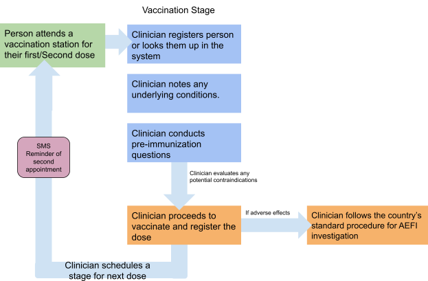
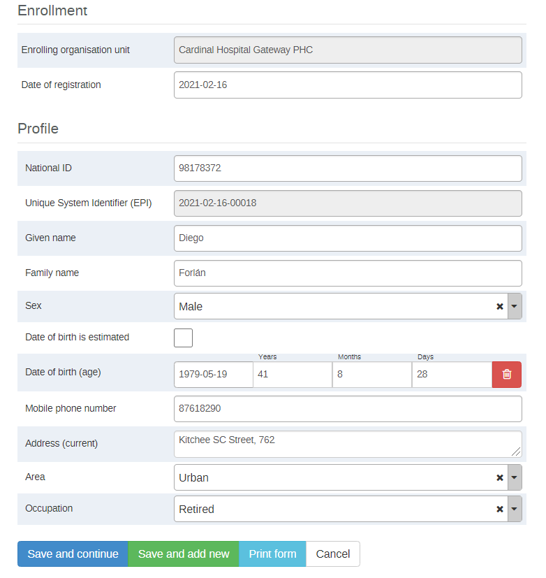
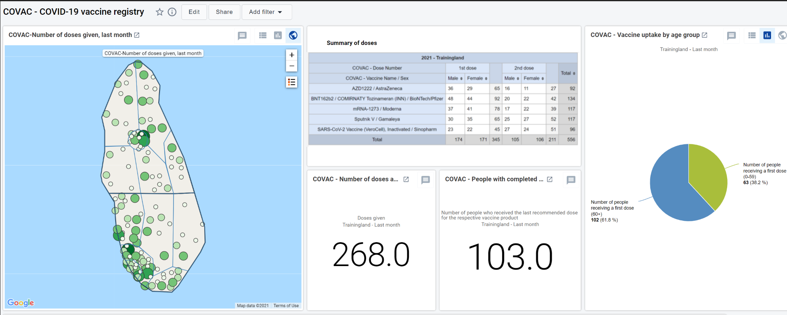
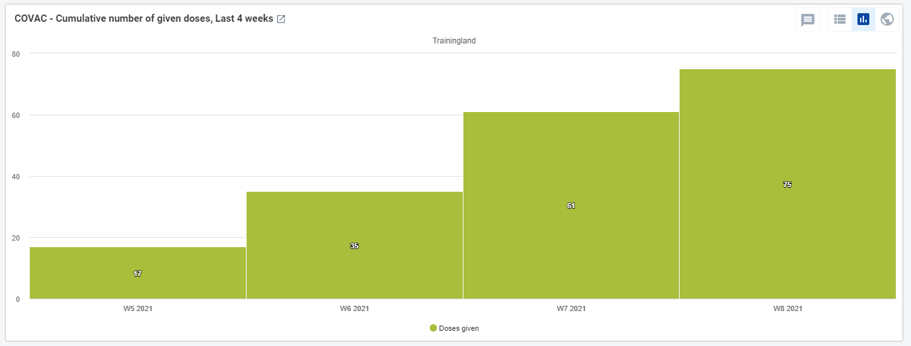
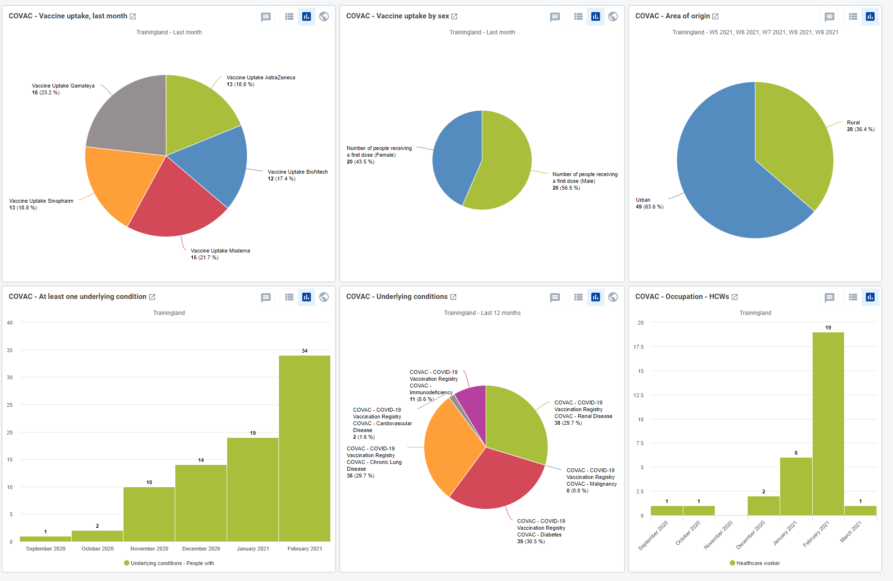
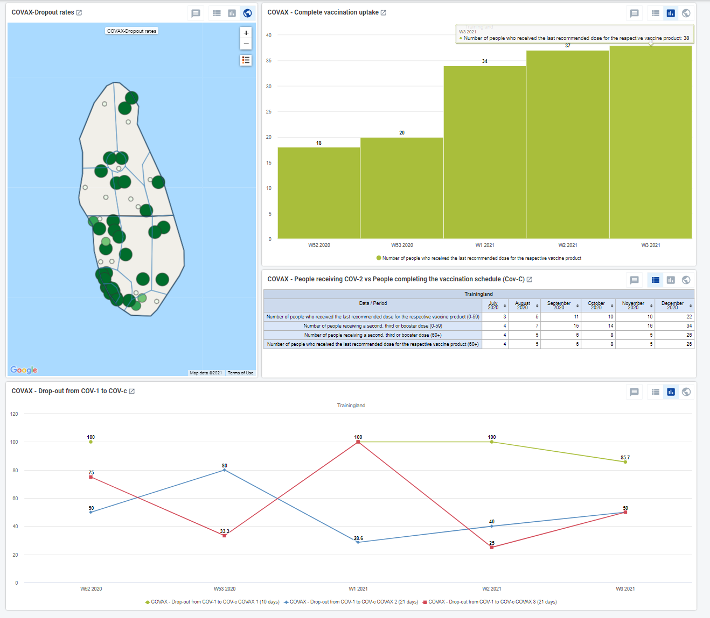
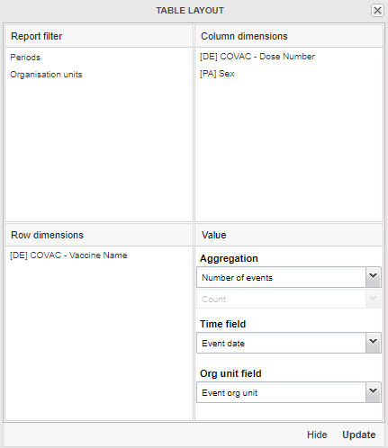

# Covid-19 Immunization Registry Tracker System Design

Last updated: 04.03.2021

DHIS2 Version compatibility:

Link to demo: <https://who.sandbox.dhis2.org/covac_demo>

## Introduction

The COVID-19 Immunization System Design document provides an overview of the conceptual design used to configure a DHIS2-tracker program serving as an electronic immunization registry for COVID-19 vaccines. This document is intended for use by DHIS2 implementers at country and regional level to be able to support implementation and localization of the package. Local work flows, national guidelines, and the respective vaccination product guidelines should be considered in the localization and adaptation of this configuration package.

This package was developed in response to an expressed need from countries and partners to monitor equity and uptake of COVID-19 vaccines across priority groups, track individuals through the completion of their

improve timeliness, accuracy of data, expand coverage, efficiency and effectiveness  delivery of the COVID-19 vaccines. It is based on the Guidance on developing a national deployment and vaccination plan for COVID-19 vaccines: <https://www.who.int/publications/i/item/WHO-2019-nCoV-Vaccine_deployment-2020.1> as well as feedback from WHO and CDC officials and general vaccination standards and guidance adapted from the DHIS2 immunization registry package

Because national guidelines and policies will vary, this package should be adapted to national context.

## System Design Overview

### Use Case

The tracker data model in DHIS2 enables an individual to be registered and followed  across a series of health services over time. This model can be leveraged to track individuals’ completion of vaccination schedules according to national policy and product recommendations, as well as capture robust individual level data to support analysis of vaccine distribution, uptake, and completion according to demographics, underlying conditions , and other variables.

### Intended Users

The programme is designed to support clinical/facility-level users, empowering staff with better decision-making tools and placing the client at the center of the information system, while also eliminating their reporting redundancies. However, depending on the infrastructure and resource availability in-country, data entry can be completed at the district level based on paper registers. 

* Clinical users: The Immunization eRegistry tracker program is optimized for data entry at Point of Care.
* Facility staff: Data can also be input into DHIS2 by data entry staff if point-of-care data entry is not feasible. Working lists are designed to support facility staff to monitor patients that need follow up or are overdue according to their vaccination schedule..
* Facility Managers, District Health Offices and National Program Staff: The data generated through the programme feeds into standardised dashboards which allow to follow vaccine uptake, dropouts, and age/gender/profession disaggregation

Illustrative workflow:

Workflows will vary from country to country. The program design should be reviewed and localized by context. For example, the workflow in the figure above assumes that individuals will be registered in DHIS2 when they present themselves at a vaccination site to receive their first dose. An alternative that can be considered is to pre-register eligible individuals into the system as Tracker Entity Instances (e.g. from an existing health worker registry). ** \

## Tracker Program Configuration

|Structure|Description|
|---|---|
|Enrollment|If a person is not already registered in the instance, they are registered and enrolled into the immunization registry as a TEI (TEI Type Person) and their data is captured in the Enrollment as attributes, which match the existing COVID-19 packages for DHIS2. TEI Attributes: National ID, Unique ID, Given name, Sex, Date of Birth is Estimated, Date of Birth (age), Mobile phone number, Address (current), Area, Occupation|
|Program Stage 1: Vaccination|This is a repeatable stage. Data is entered for this stage each time a person receives a vaccination.Event date = Date when dose was given \ Due date= Allows for scheduling of next dose|
|Section 1.1 Underlying conditions|Information on health states and/or pre-existing underlying conditions that have been determined to expose to a significantly higher risk of severe infection or death. The package contains same preexisting conditions used in the rest of the COVID packages.|
|Section 1.2 Pre-immunization questions|For the first dose, this section asks if the client has had COVID-19 within the last 90 days. After the second dose, it also asks if there is a|
|Section 1.3: Vaccination|Registers details about the vaccine type provided as well as batch number, expiration date, and provides a suggested date for next vaccination.|

### Data elements in the vaccination stage

|Data element (Form name)|Linked to Indicators|Linked to DIVOC|Linked to program rules|
|--- |--- |--- |--- |
|Dose given on (Vaccination date) Not a data element|Yes|Yes|Yes|
|Is the patient pregnant or lactating?|No|No|Yes|
|Pregnancy gestation (weeks)|No|No|Yes|
|Any underlying conditions?|No|No|Yes|
|Cardiovascular disease, including hypertension|No|No|Yes|
|Chronic Lung Disease|No|No|Yes|
|Diabetes|No|No|Yes|
|Immunodeficiency|No|No|Yes|
|Malignancy|No|No|Yes|
|Chronic neurological or neuromuscular disease|No|No|Yes|
|Renal Disease|No|No|Yes|
|Others (Please specify)|No|No|Yes|
|Has the patient been infected with COVID-19 within the last 90 days?|No|No|Yes|
|Has the patient had a severe allergic reaction (anaphylaxis) or an immediate allergic reaction—even if it was not severe—after getting the first dose of the vaccine|No|No|Yes|
|Vaccine given|Yes|Yes|Yes|
|Vaccine name|Yes|Yes|Yes|
|Please explain why this client has been administered doses of different products|No|No|Yes|
|Vaccine batch/lot number|No|Yes|No|
|Vaccine expiry date|No|No|No|
|Dose number|Yes|Yes|Yes|
|Total doses required for this vaccine product|No|Yes|Yes|
|Is this the last dose?|Yes|No|Yes|
|COVAC Suggested date for next dose|No|No|Yes|
|"Has the client had any adverse reaction following the immunization?|No|No|Yes|

### Vaccine products in the program

The specific COVID-19 products available in the country and vaccine schedules will vary by country. This package includes vaccine products following the documentation available from WHO, which will continue to evolve as vaccines enter the market: <https://extranet.who.int/pqweb/sites/default/files/documents/Status_COVID_VAX_16Feb2021.pdf>

In order to better demonstrate functionality, these placeholders have been configured based on five existing vaccine products, but it is important to verify and configure the programme based on the national adoption guidelines for the product. 

|Vaccine NAME|Option Code|Vaccine Manufacturer|Option Code|Age Recommendation|Dose Interval|Number of doses|
|--- |--- |--- |--- |--- |--- |--- |
|AZD1222/AstraZeneca|astrazeneca|AstraZeneca|astrazeneca|18|10 days (8-12)|2|
|AZD1222/AstraZeneca|astrazeneca|SKBio Astra Zeneca|skbioastrazeneca|18|10 (8-12)|2|
|BNT162b2 / COMIRNATY Tozinameran (INN) / BioNTech/Pfizer|biontechpfizer|BioNtech/Pfizer|biontechpfizer|16|21|2|
|mRNA-1273 / Moderna|moderna|Moderna|moderna|18|28|2|
|Sputnik V / Gamaleya|gamaleya|Gamaleya|gamaleya|18|21|2|
|SARS-CoV-2 Vaccine (VeroCell), Inactivated / Sinopharm|sinopharm|Sinopharm|sinopharm|18|21 days (21-28) |2|

### How to adapt the placeholders to the available vaccine products?

#### Names in the form

For the name in the form to reflect the products used in country, you would first need to modify the option sets “COVAC Vaccine manufacturers” and “COVAC Vaccine name” and change the options to names to what is appropriate for the country.

#### Auto Assigning Manufacturers to Names

Manufacturers are auto-assigned when a vaccine product is selected through program rules based on the vaccine chosen, unless the vaccine has more than one manufacturer available, in which case, a program rule will hide the options which are not relevant and the clerk will need to choose the right manufacturer name.

##### Auto assign rule

For example, the program rule “Assign name to BioNtech/Pfizer" assigns the manufacturer BioNtech/Pfizer when “Comirnaty, Tozinameran” is selected.

It uses the expression:
d2:hasValue( 'Vaccine_type' )  == true && #{Vaccine_type} == ' biontechpfizer'

And the acton for this program rule is to assign value to the Data Element “Vaccine Manufacturer” as ‘biontechpfizer’ which is the option code for “BioNTech/Pfizer”

##### Hide options rule

Currently, the only rule like this is:
“Assign names/Hide options to AstraZeneca”, as this product has two different manufacturers (AstraZeneca and SK Bio Astra Zeneca).  
This means that instead of assigning a manufacturer, the PR will hide the irrelevant manufacturers and allow the clerk to select one of the two currently available manufacturers.

#### Age alert

Depending on the vaccine there can be lower age limits. , If a vaccinator administers a dose to someone outside of that recommended age range, then a warning is issued. To modify this, please amend the program rules:

“If Age is under 18, then warn that Astra Zeneca is recommended for ages 18 and up”

“If Age is under 16, then warn that BiontechPfizer is recommended for ages 16 and up”
“If Age is under 18, then warn that Moderna is recommended for ages 18 and up”
“If Age is under 18, then warn that Gamaleya is recommended for ages 18 and up”
“If Age is under 18, then warn that Sinopharm is recommended for ages 18 and up”

The rules all use a similar expression:

(#{Age_Calculated}   < 18 ) && (#{Vaccine_type} =='astrazeneca')

Where you would need to modify the number, 18 in this case,  to match the necessary age.

The action for these program rules is to show a warning:
“This vaccine product is recommended for people 18 and older.”  

You should also modify this warning to match the most appropriate National Guidelines..

#### Assign a date for next dose

There is currently no way for a tracker to assign a date for the next event based on a data element, so what we have done is configured tracker to automatically autoschedule the next vaccination date 10 days from the first dose, assuming that the most used product would be Astra-zeneca. This must be modified to match the interval used in the country by changing the setting for the vaccination program stage in the maintenance app.  

In addition, there is also a data element that auto-assigns using program rules a recommended date depending on the vaccine product. In order to modify this, the program rule needs to be edited:

 “Assign a suggested date for next dose AstraZeneca” (there is one rule for each product)
“dhis-web-maintenance/#/edit/programSection/programRule/QWOOvnYfKbN”

The program rule has two actions

Action one: Show warning next to data element “suggested date for next dose” with the text “Next dose should be given at 10 days”  

Modify this text to match the needs.

Action two: Assign value to the data element “suggested date for next dose” with the expression d2:addDays( V{event_date}, 10 )  

Modify the number 10 with the number of days that needs to be assigned to the available vaccine.

#### Last dose

There is currently yes/no data element called “Last dose” this element is used to help indicators know when a product has completed its immunization schedule. Currently, all products have two doses, and therefore, we have set it up so that once a person is given a second dose, the DE “Last dose” is automatically checked as “Yes”. We have also hidden this DE for the first dose.
 \
To modify this warning, edit the program rule:
 “If this is the second dose, mark it as "last dose" for all vaccine products”

dhis-web-maintenance/#/edit/programSection/programRule/PJjKiFrvfuN

The expression:
d2:hasValue( 'Dose_number' ) == true && #{Dose_number} == 'DOSE2'

Indicates that if a clerk selects that the doses number given is the second dose, then it triggers an “assign value” action which adds the value “true” to the data element “Last dose”

To modify this, edit the expression to filter out the vaccine products not in use/with a different schedule.

#### Total number of doses

The data element “Total doses required for this vaccine product” is an autofilled data element which displays the amount of doses required for this vaccine product’s vaccination schedule. Currently, all vaccines have two doses in their schedule. However, there is an individual rule for each vaccine in case this changes in the future: \

To modify, edit the corresponding rule: Assign dose number to NAMEOFPRODUCT

And the expression:
d2:hasValue( 'Vaccine_type' )  == true && #{Vaccine_type} == 'astrazeneca'

If the program matches the filter, then the action will assign value to the “Total doses” data element. Currently, all rules assign the value “2” and hides the option for a third dose.

#### Access Level

The program has been set up as a “protected” program, meaning that users are able to search in other org units beyond the ones they have rights to, but if they want to access records in a different facility, they must use the “breaking the glass” function and not down why they are accessing records in a different organisation unit.  

Note that the breaking the glass feature is not supported in Android 2.3 and android users are unable to search other organisation units when the program is set as protected. <https://docs.dhis2.org/2.35/en/dhis2_android_capture_app/programs.html#breaking-the-glass>

#### Enrollment Details

The enrollment date equals the ‘Registration date’. It is intended that the user enters the enrollment date as the person is being enrolled into the Immunization Registry program. In the majority of cases, the enrollment date will coincide with the date for the first vaccination unless clients are enrolled in advance in the vaccination registry.

As the program uses the Date of Birth to calculate program indicators, it is configured as mandatory. If a person does not know their date of birth, the checkbox “Date of birth is estimated” can be used and their approximate age or an approximate DoB should be entered.

While the information on enrollment is meant to be completed when a case is first enrolled, attribute values can be updated at any point during an active enrollment if new information becomes available (eg contact information).

#### Identifiers

The program is configured with two types of unique identifiers. Additional identifiers can be added to the program based on country context.

[Unique Identifier]: An automatically generated ID which is unique to the entire system (e.g. the instance of DHIS2 being used). This TEI attribute is configured to generate the attribute value based on a pattern. It is a shared attribute with the AEFI package to facilitate searches.

[National ID]: This ID is currently manually entered and should be adapted to local validation needs.

_Enrollment screenshot_:

### Program Stage 1: Vaccination [repeatable]

Section 1.1 Underlying conditions.

The underlying conditions listed here are based on the guidelines for the COVID case surveillance and contact tracing packages, and they also include health states such as pregnancy and lactation. The pregnancy and lactation options  only appear for females. Once one of the underlying conditions (except for pregnancy) are selected, they will remain selected in the following stage (as this is a repeatable stage) and they will be listed in the indicator box. \

#### Section 1.2 Pre Immunization Questions

The Pre-Immunization Questions are intended to be completed during each ‘event’, which represents an immunization service.  Based on the answers selected, program rules are triggered to give decision support

Currently, the two questions are:

“Has the patient been infected with COVID-19 within the last 90 days”

If the answer to this is yes, a warning appears: The vaccine is recommended for people who have been free from COVID-19 infection for at least 90 days”“

And

“Has the patient had a severe allergic reaction (anaphylaxis) or an immediate allergic reaction—even if it was not severe—after getting the first dose of the vaccine”, Which only is visible to patients when they are receiving their second (or potentially, third or booster) doses. If yes is selected, it triggers the warning “Please  follow the national guidelines for AEFI investigations"

#### Section 1.3 Vaccination information

This section captures the immunization services delivered. It records:

Vaccine given  (using the option set “Vaccine name”)

Vaccine manufacturers (using the option set “Vaccine manufacturers”, autofilled)

The batch number for this dose

The date of expiration of the dose

The dose number (1st, 2nd, or booster)

The number of total doses required for this vaccine product (autofilled)

A data element to confirm if this is the last dose in the treatment (autofilled)

An automatically calculated data element giving a suggestion for the next dose (autofilled)

If a patient is administered a different vaccine type compared to the one recorded in the first inoculation, a warning is shown: “The vaccine type you have selected is not the same as the previous vaccine type this person received. Last does they were administered was 'NAME OF PREVIOUSLY GIVEN VACCINE'” This also triggers an additional Data Element “Please explain why this client has been administered doses of different products”

Once a client has received the first dose, the option for the first dose is hidden from the data element. For products with only two doses in the schedule, the third is hidden. Countries can configure this depending on the vaccine products they will be adopting.

#### Scheduling events

The stage is configured to ‘Ask the user to create a new event when a stage is completed’, which triggers a pop-up for scheduling the follow-up appointment. ‘Standard interval days’ are currently set to 10 so that the next appointment (event) date is scheduled 10 days from the current event date by default, but can be modified depending on the product used.

### User Groups

The programme is packaged together with three user groups:

COVAC - Covid Immunization Metadata manager: Has the rights to edit the metadata of the package but not to enter data into the package
COVAC - Covid Immunization Data Capture: Has the rights to enter data into tracker
COVAC - Cpvod Immunization Data Analysis: Has access to the dashboards, but cannot enter data.

These should be adapted to national needs

## Certificate Printing

### SMS Notifications

DHIS2 has an SMS notifications module, but in order to use the notifications, and SMS gateway needs to be configured. See documentation on sms gateways here: <https://docs.dhis2.org/en/develop/using-the-api/dhis-core-version-master/sms.html>

The programme includes a default reminder 7 days before the scheduled due date for a vaccination event:

“Dear NAME OF CLIENT, you have an appointment to receive your COVID-19 vaccine on the DUE DATE at NAME OF FACILITY  

And a message 3 days after the scheduled due date:

“Dear A{TfdH5KvFmMy}, your appointment for a COVID-19 vaccine dose was on the V{due_date}, if you did not receive your vaccine, please contact V{org_unit_name} as soon as possible. If you have received your vaccine, please ignore this message”

**NOTE:** Due to current limitations of the SMS module, the message scheduled three days after the due date will be sent regardless of whether the event took place or not. Until this issue is fixed, a workaround is to configure a cronjob script which checks for overdue events and schedules a message.

### Working Lists

Three custom working lists have been configured in the program. These lists are meant to facilitate the management of the work day of the health care workers at point of care with lists of clients depending on their vaccination schedule, and to highlight overdue appointments.  

The lists are customised based on the “due date” function. The Due date is the date that is assigned for the next event and is done as soon as the first event is completed. Currently, the system automatically selects an appointment 10 days after the first vaccination, and the clerk or clinician should modify this date if necessary. It is therefore important that the scheduling is done correctly in order to use the working lists.

All active registered clients:
Clients who are registered in the COVID vaccine programme, and clients whose enrollment wasn’t completed. It is assumed that clients who have received all doses of their vaccines will have completed their enrollment in the vaccination program. The incomplete enrollment will therefore be indicative of all the clients who have not received a second dose (or the last dose for vaccines with different schedules)-independently on whether they are on schedule or overdue

Clients with scheduled appointments:
Those who have a vaccination programme stage scheduled into the future or current day

Clients overdue a vaccination dose:
Those who have a scheduled appointment in the past, and are therefore overdue to get a vaccine dose.

Completed clients:
Those whose enrollment has been completed

## Analytics

### Program Indicators

Program indicators have been configured to align with the WHO Monitoring Guidelines for COVID-19 vaccine delivery. These program indicators can facilitate pushing aggregated data from the tracker program to the COVID-19 core aggregate module for analysis. This can be particularly useful if a country has hybrid systems in place, where some sites use the electronic immunization registry and others may rely on paper-based reporting.  

#### Number of people receiving a first dose - COV-1

The number of people receiving a first dose of the vaccine

This is a programme indicator which filters those who are marked as having received the first dose of the vaccine.

#### Number of people receiving a second, third or booster dose - COV-2

The number of people receiving a second or third dose of the vaccine, plus any booster doses. This is a programme indicator which filters using the same data element as COV-1, but with the second, third or booster dose.

#### Number of people who received the last recommended dose for the respective vaccine product - COV-c

 The number of people who received the last recommended dose for the respective vaccine product. The “c” denotes the dose that completes the schedule, which might be a first, second or third dose depending on the product that was used.

#### Doses given  COV-n

This program indicator counts the raw amount of doses given  

#### Drop-out from COV-1 to COV-c

The proportion of people who received at least one dose of a COVID-19 vaccine but did not receive the last dose in the schedule yet. Calculated as: (COV-1 – COV-c)/COV-1  We have made a drop-out indicator for each of the placeholder vaccine products in the tracker program.

For a more accurate and timely dropout rate during a large scale up of two-dose vaccinations, the dashboards do not show gross totals first dose and last doses provided each reporting period. Instead, the dropout rate is calculated using a discrete time boundary between enrollment and final dose. For example, if a maximum 30 day period is assumed between the first and final doses, then a patient provided a first dose is only considered a "dropout" during a reporting period that is exactly 30 days after the first dose. The patient is not considered as a dropout less than 30 days after the first dose, and is not included as a dropout in subsequent reporting periods.
For these indicators, we have assumed:
For AstraZeneca: 10 days

For PfizerBionTech: 21 days

For Moderna: 28 days

For Gamaleya: 21 days

For Sinovac: 28 days

#### Vaccine uptake

The amount of people who have received at least one dose of one of the respective vaccine products. There is one indicator per product.

### Dashboards

The immunization registry dashboard contains key monitoring indicators that are aligned with the WHO’s Monitoring Guidance for COVID-19 vaccine delivery and the aggregate COVID-19 immunisation package.

The first group of items in the dashboard gives a quick overview of the uptake of vaccines, doses administered, and disaggregates them by variables such as sex, age, geographical area, and vaccines. The second group of items shows the drop-out rates and the numbers of completed vaccination schedules.

## Considerations for when implementing with Android devices

### Access level ‘protected’

The ‘breaking the glass’ feature is not yet supported in DHIS2 Android Capture App as of v. 2.3. If the program is configured as ‘Protected’, the default behavior for Android will be the same as if the program is configured as ‘closed.’ This means that an Android user will not be able to read or edit enrollments of a TEI outside of their org unit. TEIs registered in a Search OU will be returned by the TE Type search but if the program is closed or protected the user will not be allowed to see or create a new enrollment. If Android users must be able to access TEI outside of their data capture org unit, the program should be configured with access level ‘Open.’ <https://jira.dhis2.org/browse/ANDROAPP-657>

### Dose due date

The description of the due date is not correctly displayed on android and instead of saying “Dose due date” it says “Due date” <https://jira.dhis2.org/browse/ANDROAPP-3620>

## Import considerations

### Importing event reports

There is currently a bug that prevents the importing event reports. <https://jira.dhis2.org/browse/DHIS2-10163>

Use the events report app and select the “Pivot table” function and the “event” output type. Then select the data element “COVAC - Dose Number” and add the doses 1 and 2 (3+ booster if the used vaccine products require it); the Program attribute “Sex”; and the DE “COVAC - Vaccine name”.

Arrange then the layout of the table with DE COVAC - Dose Number and PA Sex in the Column dimensions, and DE COVAC - Vaccine Name in the Row Dimensions:

### Importing Event Charts

There is also a bug which prevents the import of Event Charts in DHIS2 2.34 - the issue has not been identified while importing in 2.35. The following charts will need to be rebuilt manually.

#### COVAC - Area of Origin

The pie chart can be obtained selecting the PA - "Area Urban Rural" and then arranging the layout as per the screenshot below.

#### COVAC - Occupation

The bar chart can be created selecting the PA - COVID - Occupation and selecting among the options “Health Care Workers”. The layout of the graph should then be arranged as follows:

## Performance considerations

If you experience that tracker is showing slow load times, please get in touch with the implementation team. This is likely related to the working lists and a large number of TEIs in one org unit. A solution is to disable the “Display front page list” check in the program details. This has the downside of also disabling working lists.

Even though the package is published from 2.33, our testing indicates that the best performance is achieved by installing it on an instance running DHIS2 2.35 and up and ensuring that their server has a JDK with java 11.

## **To do for next version:**

* SMS notifications:
**Sms notification: “Second dose still overdue (48hs past due date)” to be sent only when people are overdue.

* Refusal of vaccination Data element + Vaccination not given w/ Option set Stockout Postpone Contraindication Refusal Other
* Stock considerations
