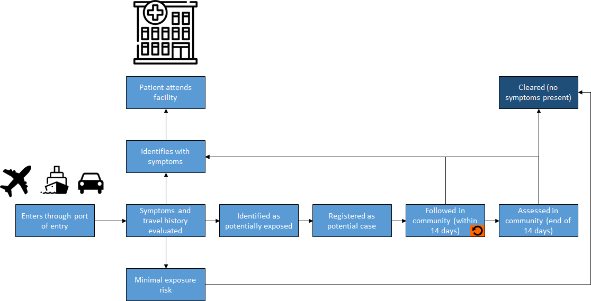
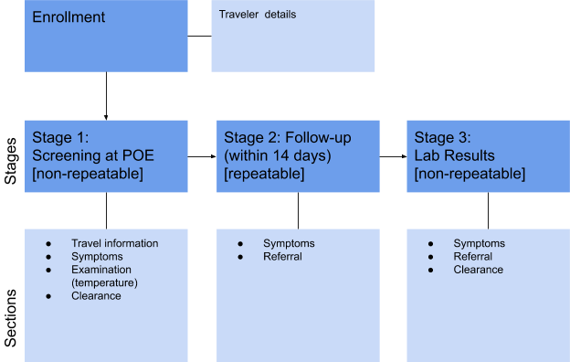
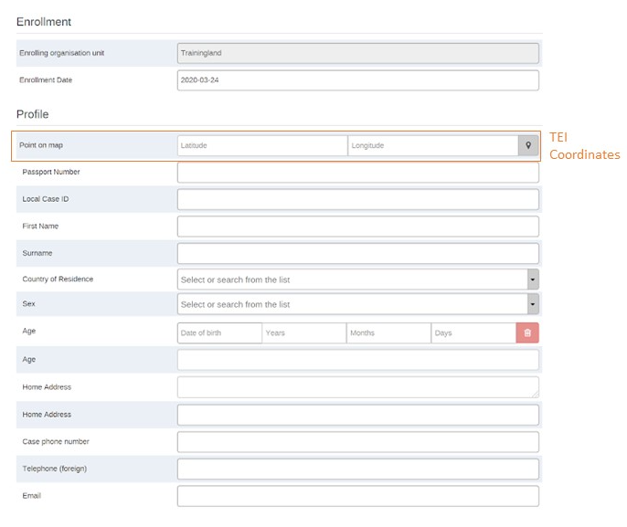
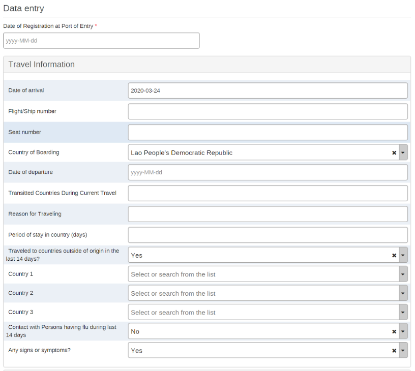
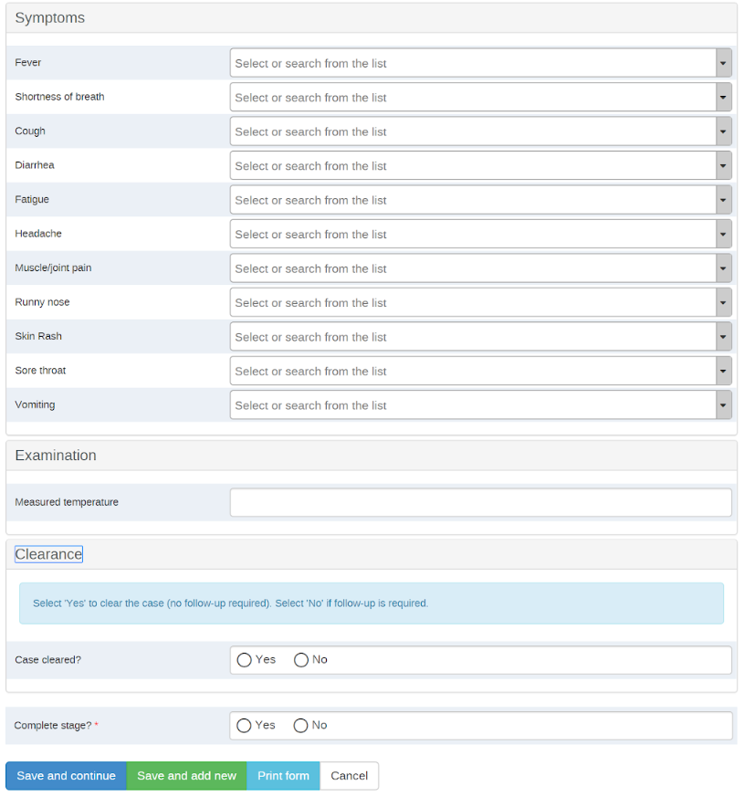
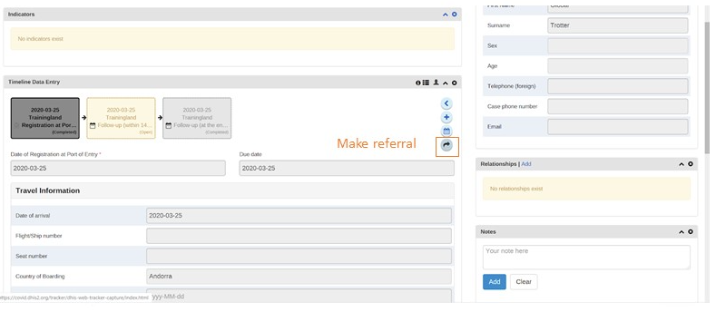

# COVID-19 Points of Entry Tracker System Design v0.3.1

Last updated 24/03/2020

Package version: 0.3.1

DHIS2 Version compatibility 2.33.2

Demo: <https://covid19.dhis2.org/>

## Purpose

The COVID-19 Points of Entry (POE) Screening System Design document provides an overview of the conceptual design used to configure a COVID-19 digital data package in DHIS2. The COVID-19 package was developed in response to an expressed need from countries to rapidly adapt a solution for managing COVID-19 data. This document is intended for use by DHIS2 implementers at country and regional level to be able to support implementation and localisation of the package. The COVID-19 metadata package can be adapted to local needs and national guidelines. In particular, local work flows and national guidelines should be considered in the localization and adoption of the programs included in this package.

## Background

The Points of Entry Screening Tracker is inspired by the pioneering design implemented by HISP Sri Lanka to support the Sri Lanka Ministry of Health. In January 2020, the Sri Lanka MOH implemented screening measures at ports of entry like airports to identify travelers who may have been exposed to nCoV-19. DHIS2 tracker was to enroll travelers entering Sri Lanka who had visited countries impacted by COVID-19. DHIS2 tracker enabled follow-up with travelers at field level for 14 days to ensure no symptoms developed. If symptoms developed, travelers would be referred to a health facility for clinical examination and testing. The POE tracker can be used in combination with other COVID-19 digital data packages that include case surveillance and contact tracing.

The World Health Organisation (WHO) has published [technical guidance for the management of ill persons at points of entry](https://www.who.int/emergencies/diseases/novel-coronavirus-2019/technical-guidance/points-of-entry-and-mass-gatherings). Points of entry (POE) include international airports, seaports and land crossings. POE measures include 1) detection of ill travellers; 2) interview of ill travellers for COVID-19; 3) reporting of alerts of ill travellers with suspected COVID-19 infection and 4) isolation, initial case management and referral of ill travellers with suspected COVID-19 infection. These guidelines should be consulted, in addition to national protocols for points of entry.

## System Design Summary

### Use Case

The POE tracker program use case was designed to support the registration of travelers entering a country with a history of travel to, or residence in, a country/area/territory reporting local transmission of COVID-19 who may need to be followed up to ensure no symptoms develop. For this use case, it is assumed that a traveler may be 1) screened and cleared immediately with no follow-up needed; 2) screened and followed up for 14 days [with or without isolation measures] to ensure no symptoms develop; or 3) screened and referred for testing and/or initial case management. The current design proposes that a traveler meeting the country’s definition of a suspected case would be enrolled into the complementary DHIS2 COVID-19 Case-Based Surveillance (CBS) Tracker. For example, a traveler enrolled in this program who later meets the definition of a suspected case during follow-up (i.e. an asymptomatic traveler from a country with known transmission is registered at the POE and later develops symptoms) is enrolled as a suspected case into the COVID-19 CBS program to capture all clinical details, exposures and follow the case through laboratory diagnosis and case outcome.

In the development of this configuration package, an effort has been made to follow UiO’s [general design principles](https://who.dhis2.org/documentation/general_design_principles.html) and a common [naming convention](https://who.dhis2.org/documentation/naming_convention.html).

DHIS2 digital data packages are optimized for Android data collection with the DHIS2 Capture App, free to download on the [Google Play store](https://play.google.com/store/apps/details?id=com.dhis2&hl=en).

### Intended users

* POE users: personnel responsible for screening travelers at points of entry such as airports, seaports and land crossings who may conduct initial screening at POE, make a determination about the traveler’s clearance and register the traveler into the Tracker program.
* Public health workers: personnel responsible for following up with travelers for 14 days to inquire about onset of symptoms and refer the person for testing if required.
* National and local health authorities: monitor and analyse data through dashboards and analytics tools to conduct risk assessments and plan response measures.

### Workflow

The Points of Entry program workflow is based on the following scenario

In this design, it is assumed a traveler would complete their enrollment in the POE under the following scenarios:

1. Traveler is marked as ‘cleared’ during initial screening or after 14 day follow-up
2. Traveler is referred to health facility at any point during follow-up

**A traveler that is referred to a health facility is expected to be enrolled in the COVID-19 Case-based Surveillance Tracker as a suspected case** (according to national guidelines). Details about a suspected case including clinical exam, exposures, laboratory results and case outcome would be recorded in the CBS program. 

### Structure: Points of Entry Screening Tracker Program

#### Consideration for Organisation Units & Geography

This program design assumes that Points of Entry such as airports, seaports or land crossings will be created as organisation units included in the OU hierarchy. The program would be assigned to the POE org units. Primary analysis is based on the enrolling Org Unit (the port of entry).

Additional geographical components are also captured as other dimensions:

1. TEI coordinates: It is possible to capture TEI coordinates when registering the traveler as TEI. These can be displayed in the maps app. Local protocols may choose what coordinates to enter, for example the TEI’s local residence where he/she may be self-quarantined for 14 days.
2. Event coordinates: for screening and follow-up stages, coordinates can be captured on the event and displayed in a map. For example, the user may capture a traveler’s location each time they are followed up (i.e. in the case of tourists or others not in home quarantine).

#### Program Description

|Stage|Description|
|--|--|
|**Registration**|The Tracked Entity is the traveler, which is represented by the Tracked Entity Type of ‘person.’ The TEI is configured to collect a geographic ‘point’ during registration. These can be analyzed in a map.|
|**Enrollment details**|Enrollment date The first Program Stage is configured to appear on the Registration page so that a user does not need to click through to add the first event.|
|**Attributes**|Attributes include basic personal information and unique case identifiers - Passport number - Local Case ID - Age - First Name - Surname - Country of residence - Sex - Date of birth - Local address - Home address - Telephone (local) - Telephone (foreign) - Emergency contact - Emergency contact phone - Email|
|**Stage 1** **Screening at POE** **(non-repeatable)**|This stage records: - Traveler details (countries visited, flight number, date of departure, etc) - Examination: recorded temperature - Symptoms: this list includes symptoms typically checked for both COVID-19 symptoms and symptoms of other potential notifiable diseases - Case clearance  If the traveler is marked as ‘cleared’, no further follow up is required; the enrollment may be closed. If the traveler requires follow-up, an event can be scheduled for follow-up.  The data entry form is blocked after completion; no further changes can be made without authorization.|
|**Stage 2:** **Follow-up (within 14 days)** **(repeatable)**|Data is entered at this stage if any interim follow-up is performed before the end of 14 days. Event coordinates can be captured (i.e. the current location of the traveler at the time follow-up was completed) to present in a map. - Symptoms - Referral (user may select an Organisation Unit in a Data Element configured as type OU, for example to select a health facility where a traveler was referred after reporting symptoms)  If a traveler has symptoms and is referred to a health facility for testing, the traveler should be enrolled into the Case based Surveillance program. The enrollment may be closed if no further monitoring & follow-up is planned in this program.  The data entry form is blocked after completion; no further changes can be made without authorization.|
|**Stage 3:** **Follow-up (after 14 days)** **(non-repeatable)**|Data is entered at this stage at the end of 14 days. Event coordinates can be captured (i.e. the current location of the traveler at the time follow-up was completed) to present in a map. - Symptoms - Referral (user may select an Organisation Unit in a Data Element configured as type OU, for example to select a health facility where a traveler was referred after reporting symptoms) - Case clearance  If a traveler has symptoms and is referred to a health facility for testing, the traveler should be enrolled into the Case based Surveillance program. The enrollment should be closed at the completion of 14 day follow-up.  The data entry form is blocked after completion; no further changes can be made without authorization.

")

")

#### How to refer the TEI to another Organisation Unit

Primary analysis is completed on the enrolling organisation unit (the port of entry). Referral facility is captured as a Data Element (type: Organisation Unit) in order to display travelers by referral to health facility in the analytics apps (i.e. Event Report). In some use cases, it may be desirable to refer the TEI (the traveler) to another Org Unit for follow-up.

A TEI can be ‘referred’ to another org unit such as a health facility for one event or permanently. In this case, health facility user must be able to search TEIs enrolled in the relevant Points of Entry org units. For example, if after screening a traveler at the POE, the traveler may be “referred” to a district health office near the traveler’s local address for follow-up by district health staff. After completing the data entry for Stage 1 (screening), the user would refer the TEI to a District Health Center. Read more about referrals in tracker in [DHIS2 2.33 User Documentation](https://docs.dhis2.org/2.33/en/dhis2_user_manual_en/using-the-tracker-capture-app.html#refer-an-event).

### Program Relationships

This program has the relationshipType ‘Has been in contact with’. Users can create a relationship between TEIs enrolled in the POE program and TEIs in other COVID-19 tracker programs (Case-based Surveillance, Contact Registration & Follow-up). The relationship can be added at any point in the program stages during data entry.

### Program Rules

The following program rules have been configured.

|Program Rule Name|Program Rule Description|
|--|--|
|Calculate and assign patient age in years|Calculate and assign patient age in years|
|Hide countries if not visited|Hide countries if not visited|
|Hide Follow-Up Stages|Hide Follow-Up Stages if the case is cleared at the port of entry|
|Hide symptoms if no symptoms present (Follow Up at the end of 14 days)|Hide symptoms if no symptoms present (Follow Up at the end of 14 days)|
|Hide symptoms if no symptoms present (Follow Up within 14 days)|Hide symptoms if no symptoms present (Follow Up within 14 days)|
|Hide symptoms if no symptoms present (PoE)|Hide symptoms if no symptoms present (PoE)|

You can read more about program rules here:
[https://docs.dhis2.org/master/en/user/html/configure_program_rule.html](https://docs.dhis2.org/master/en/user/html/configure_program_rule.html)

### Indicators and Program Indicators

|||
|--|--|
|COVID-19 travelers screened|Total number of travelers screened and enrolled in screening program from POE|
|COVID-19 travelers cleared at POE|Number of travelers cleared after POE screening (no follow-up required)|
|COVID-19 travelers with symptoms at POE|Number of travelers presenting with symptoms during POE screening|
|COVID-19 travelers cleared after 14 days monitoring|Number of travelers that are cleared after 14 day follow up (no onset of symptoms during 14 day period)|
|COVID-19 travelers referred to health facility|Number of travelers that were referred to a health facility at any time during 14 day followup|
|COVID-19 travelers enrolled for 14 day follow-up|Number of travelers that did not present with symptoms at POE screening and were not cleared at POE screening|
|COVID-19 currently under follow-up|Number of travelers that have not been cleared or referred to a health facility|
|COVID-19 travelers developed symptoms during follow-up|Number of travelers that developed symptoms during follow-up (exclude travelers presenting with symptoms during POE screening)|
|COVID-19 % travelers developed symptoms during 14-day follow-up|Numerator: Number of travelers that developed symptoms during follow-up (exclude travelers presenting with symptoms during POE screening) Denominator: Number of travelers that did not present with symptoms at POE screening and were not cleared at POE screening|

Users can also generate an Event Report to see:

1. Travelers by nationality and/or originating country
2. Referrals to health facility

## References

* DHIS2 COVID-19 [Tracker Package Installation Guide](https://docs.google.com/document/d/1iILgYYYDXDKpizkxY08syMfrw_9POzMMIMwd5Nb7yl4/edit#heading=h.imcis8rm8nq6)
* World Health Organisation (WHO) [technical guidance for the management of ill persons at points of entry](https://www.who.int/emergencies/diseases/novel-coronavirus-2019/technical-guidance/points-of-entry-and-mass-gatherings) (interim guidance, published 19 March 2020)
